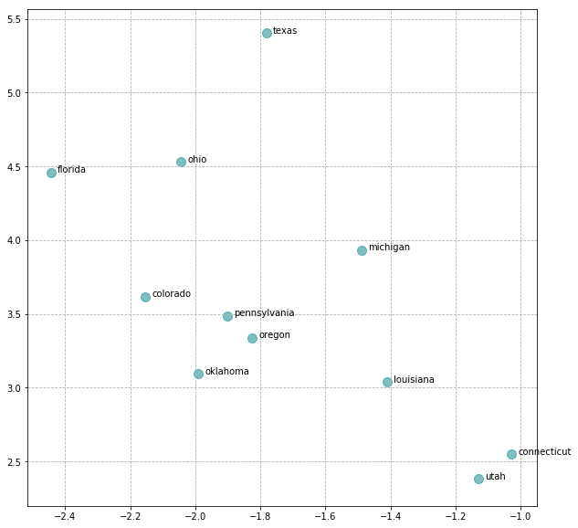
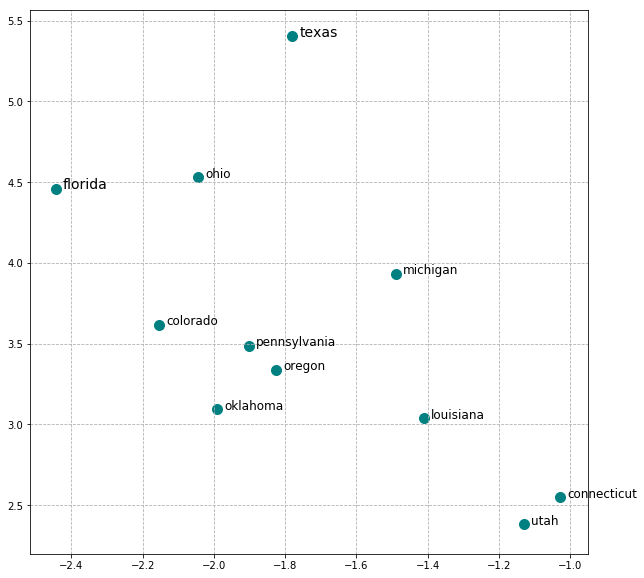
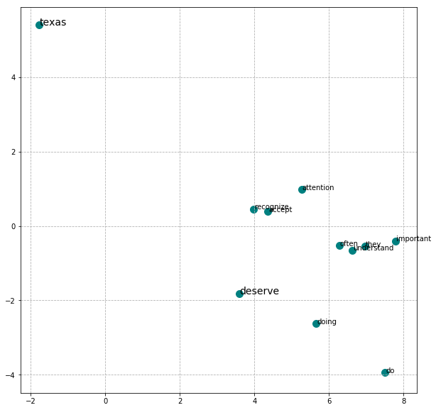
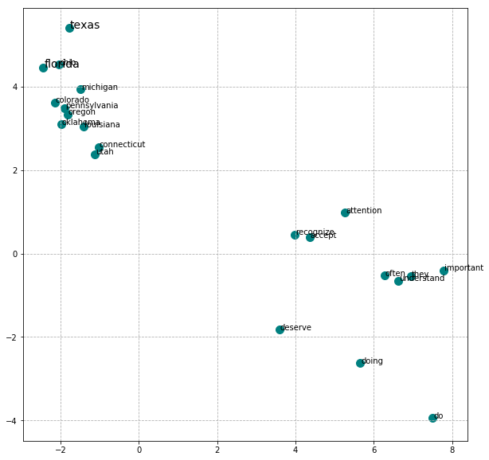
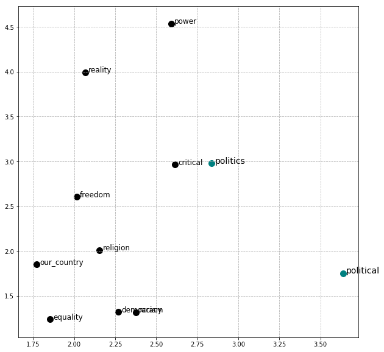

### Questions
- What is the understanding of the intuition behind word2vec

### Objectives
YWBAT
- build a word2vec model in gensim
- create visualizations using gensim's word2vec tool
- apply phrase analysis on text

### Outline
- define a word embedding
- load and clean data for modeling
- build word2vec model using gensim
- create visualizations
- phrase analysis 


```python
import pandas as pd
import numpy as np

from gensim.models import Word2Vec, Phrases
from nltk import word_tokenize

import matplotlib.pyplot as plt
```


```python
df = pd.read_json("News_Category_Dataset_v2.json", lines=True)
df.head()
```


<div>
<style scoped>
    .dataframe tbody tr th:only-of-type {
        vertical-align: middle;
    }

    .dataframe tbody tr th {
        vertical-align: top;
    }

    .dataframe thead th {
        text-align: right;
    }
</style>
<table border="1" class="dataframe">
  <thead>
    <tr style="text-align: right;">
      <th></th>
      <th>authors</th>
      <th>category</th>
      <th>date</th>
      <th>headline</th>
      <th>link</th>
      <th>short_description</th>
    </tr>
  </thead>
  <tbody>
    <tr>
      <th>0</th>
      <td>Melissa Jeltsen</td>
      <td>CRIME</td>
      <td>2018-05-26</td>
      <td>There Were 2 Mass Shootings In Texas Last Week...</td>
      <td>https://www.huffingtonpost.com/entry/texas-ama...</td>
      <td>She left her husband. He killed their children...</td>
    </tr>
    <tr>
      <th>1</th>
      <td>Andy McDonald</td>
      <td>ENTERTAINMENT</td>
      <td>2018-05-26</td>
      <td>Will Smith Joins Diplo And Nicky Jam For The 2...</td>
      <td>https://www.huffingtonpost.com/entry/will-smit...</td>
      <td>Of course it has a song.</td>
    </tr>
    <tr>
      <th>2</th>
      <td>Ron Dicker</td>
      <td>ENTERTAINMENT</td>
      <td>2018-05-26</td>
      <td>Hugh Grant Marries For The First Time At Age 57</td>
      <td>https://www.huffingtonpost.com/entry/hugh-gran...</td>
      <td>The actor and his longtime girlfriend Anna Ebe...</td>
    </tr>
    <tr>
      <th>3</th>
      <td>Ron Dicker</td>
      <td>ENTERTAINMENT</td>
      <td>2018-05-26</td>
      <td>Jim Carrey Blasts 'Castrato' Adam Schiff And D...</td>
      <td>https://www.huffingtonpost.com/entry/jim-carre...</td>
      <td>The actor gives Dems an ass-kicking for not fi...</td>
    </tr>
    <tr>
      <th>4</th>
      <td>Ron Dicker</td>
      <td>ENTERTAINMENT</td>
      <td>2018-05-26</td>
      <td>Julianna Margulies Uses Donald Trump Poop Bags...</td>
      <td>https://www.huffingtonpost.com/entry/julianna-...</td>
      <td>The "Dietland" actress said using the bags is ...</td>
    </tr>
  </tbody>
</table>
</div>


```python
df["combined_text"] = df["headline"] + " " + df["short_description"]
df.head()
```


<div>
<style scoped>
    .dataframe tbody tr th:only-of-type {
        vertical-align: middle;
    }

    .dataframe tbody tr th {
        vertical-align: top;
    }

    .dataframe thead th {
        text-align: right;
    }
</style>
<table border="1" class="dataframe">
  <thead>
    <tr style="text-align: right;">
      <th></th>
      <th>authors</th>
      <th>category</th>
      <th>date</th>
      <th>headline</th>
      <th>link</th>
      <th>short_description</th>
      <th>combined_text</th>
    </tr>
  </thead>
  <tbody>
    <tr>
      <th>0</th>
      <td>Melissa Jeltsen</td>
      <td>CRIME</td>
      <td>2018-05-26</td>
      <td>There Were 2 Mass Shootings In Texas Last Week...</td>
      <td>https://www.huffingtonpost.com/entry/texas-ama...</td>
      <td>She left her husband. He killed their children...</td>
      <td>There Were 2 Mass Shootings In Texas Last Week...</td>
    </tr>
    <tr>
      <th>1</th>
      <td>Andy McDonald</td>
      <td>ENTERTAINMENT</td>
      <td>2018-05-26</td>
      <td>Will Smith Joins Diplo And Nicky Jam For The 2...</td>
      <td>https://www.huffingtonpost.com/entry/will-smit...</td>
      <td>Of course it has a song.</td>
      <td>Will Smith Joins Diplo And Nicky Jam For The 2...</td>
    </tr>
    <tr>
      <th>2</th>
      <td>Ron Dicker</td>
      <td>ENTERTAINMENT</td>
      <td>2018-05-26</td>
      <td>Hugh Grant Marries For The First Time At Age 57</td>
      <td>https://www.huffingtonpost.com/entry/hugh-gran...</td>
      <td>The actor and his longtime girlfriend Anna Ebe...</td>
      <td>Hugh Grant Marries For The First Time At Age 5...</td>
    </tr>
    <tr>
      <th>3</th>
      <td>Ron Dicker</td>
      <td>ENTERTAINMENT</td>
      <td>2018-05-26</td>
      <td>Jim Carrey Blasts 'Castrato' Adam Schiff And D...</td>
      <td>https://www.huffingtonpost.com/entry/jim-carre...</td>
      <td>The actor gives Dems an ass-kicking for not fi...</td>
      <td>Jim Carrey Blasts 'Castrato' Adam Schiff And D...</td>
    </tr>
    <tr>
      <th>4</th>
      <td>Ron Dicker</td>
      <td>ENTERTAINMENT</td>
      <td>2018-05-26</td>
      <td>Julianna Margulies Uses Donald Trump Poop Bags...</td>
      <td>https://www.huffingtonpost.com/entry/julianna-...</td>
      <td>The "Dietland" actress said using the bags is ...</td>
      <td>Julianna Margulies Uses Donald Trump Poop Bags...</td>
    </tr>
  </tbody>
</table>
</div>


### clean data 


```python
def clean_text(text, punctuation=".?!,:;()'"):
    text = text.lower().strip().strip("\n")
    text = text.replace("\xa0", "")
    text = text.replace("\n", " ")
    text = text.replace("é", "e")
    text = text.replace("...", "")
    text = text.replace("\xad", "")
    for p in punctuation:
        text = text.replace(p, "")
    return text
```


```python
df["clean_combined_text"] = [clean_text(text, punctuation=",:;()'’" + '"”‘“') for text in df["combined_text"]]
df.head()
```


<div>
<style scoped>
    .dataframe tbody tr th:only-of-type {
        vertical-align: middle;
    }

    .dataframe tbody tr th {
        vertical-align: top;
    }

    .dataframe thead th {
        text-align: right;
    }
</style>
<table border="1" class="dataframe">
  <thead>
    <tr style="text-align: right;">
      <th></th>
      <th>authors</th>
      <th>category</th>
      <th>date</th>
      <th>headline</th>
      <th>link</th>
      <th>short_description</th>
      <th>combined_text</th>
      <th>clean_combined_text</th>
    </tr>
  </thead>
  <tbody>
    <tr>
      <th>0</th>
      <td>Melissa Jeltsen</td>
      <td>CRIME</td>
      <td>2018-05-26</td>
      <td>There Were 2 Mass Shootings In Texas Last Week...</td>
      <td>https://www.huffingtonpost.com/entry/texas-ama...</td>
      <td>She left her husband. He killed their children...</td>
      <td>There Were 2 Mass Shootings In Texas Last Week...</td>
      <td>there were 2 mass shootings in texas last week...</td>
    </tr>
    <tr>
      <th>1</th>
      <td>Andy McDonald</td>
      <td>ENTERTAINMENT</td>
      <td>2018-05-26</td>
      <td>Will Smith Joins Diplo And Nicky Jam For The 2...</td>
      <td>https://www.huffingtonpost.com/entry/will-smit...</td>
      <td>Of course it has a song.</td>
      <td>Will Smith Joins Diplo And Nicky Jam For The 2...</td>
      <td>will smith joins diplo and nicky jam for the 2...</td>
    </tr>
    <tr>
      <th>2</th>
      <td>Ron Dicker</td>
      <td>ENTERTAINMENT</td>
      <td>2018-05-26</td>
      <td>Hugh Grant Marries For The First Time At Age 57</td>
      <td>https://www.huffingtonpost.com/entry/hugh-gran...</td>
      <td>The actor and his longtime girlfriend Anna Ebe...</td>
      <td>Hugh Grant Marries For The First Time At Age 5...</td>
      <td>hugh grant marries for the first time at age 5...</td>
    </tr>
    <tr>
      <th>3</th>
      <td>Ron Dicker</td>
      <td>ENTERTAINMENT</td>
      <td>2018-05-26</td>
      <td>Jim Carrey Blasts 'Castrato' Adam Schiff And D...</td>
      <td>https://www.huffingtonpost.com/entry/jim-carre...</td>
      <td>The actor gives Dems an ass-kicking for not fi...</td>
      <td>Jim Carrey Blasts 'Castrato' Adam Schiff And D...</td>
      <td>jim carrey blasts castrato adam schiff and dem...</td>
    </tr>
    <tr>
      <th>4</th>
      <td>Ron Dicker</td>
      <td>ENTERTAINMENT</td>
      <td>2018-05-26</td>
      <td>Julianna Margulies Uses Donald Trump Poop Bags...</td>
      <td>https://www.huffingtonpost.com/entry/julianna-...</td>
      <td>The "Dietland" actress said using the bags is ...</td>
      <td>Julianna Margulies Uses Donald Trump Poop Bags...</td>
      <td>julianna margulies uses donald trump poop bags...</td>
    </tr>
  </tbody>
</table>
</div>


### create word embeddings


```python
### get vocab
vocab = set(word for text in df.clean_combined_text for word in text.split(" "))
len(vocab)
```


    151626


```python
tokenized_text = [text.split(" ") for text in df.clean_combined_text]
tokenized_text[0]
```


    ['there',
     'were',
     '2',
     'mass',
     'shootings',
     'in',
     'texas',
     'last',
     'week',
     'but',
     'only',
     '1',
     'on',
     'tv',
     'she',
     'left',
     'her',
     'husband.',
     'he',
     'killed',
     'their',
     'children.',
     'just',
     'another',
     'day',
     'in',
     'america.']


```python
embedding = Word2Vec(sentences=tokenized_text, size=30)
```

### Save your model for future use


```python
embedding.save("w2v_model_s30")
```

### Load it in when needed


```python
embedding = Word2Vec.load("w2v_model_s30")
```

    /anaconda3/lib/python3.7/site-packages/smart_open/smart_open_lib.py:398: UserWarning: This function is deprecated, use smart_open.open instead. See the migration notes for details: https://github.com/RaRe-Technologies/smart_open/blob/master/README.rst#migrating-to-the-new-open-function
      'See the migration notes for details: %s' % _MIGRATION_NOTES_URL


### Now let's play around with our model!!! :) 


```python
embedding.wv.most_similar(positive=['texas'])
```


    [('florida', 0.9480490684509277),
     ('oregon', 0.9319947957992554),
     ('connecticut', 0.9277305603027344),
     ('louisiana', 0.9266656637191772),
     ('utah', 0.9156169295310974),
     ('colorado', 0.9147211909294128),
     ('michigan', 0.9123942852020264),
     ('oklahoma', 0.9115188121795654),
     ('pennsylvania', 0.9061980247497559),
     ('ohio', 0.9032790660858154)]


```python

```

### Let's plot these words


```python
X = embedding[embedding.wv.vocab] # get my vectors and store them in X
X[:1]
```

    /anaconda3/lib/python3.7/site-packages/ipykernel_launcher.py:1: DeprecationWarning: Call to deprecated `__getitem__` (Method will be removed in 4.0.0, use self.wv.__getitem__() instead).
      """Entry point for launching an IPython kernel.


    array([[-7.1740067e-01,  4.0593519e+00, -2.8041775e+00,  3.5756748e+00,
             9.2844105e-01,  1.5091631e+00, -2.9064245e+00, -3.8687980e-03,
             3.1011260e+00, -1.3941528e-01,  3.1147366e+00,  2.3686349e+00,
             6.6410249e-01, -3.5142045e+00, -7.3795505e+00, -2.5086057e+00,
            -3.2340646e-01,  1.2376199e+00,  2.1115911e+00,  1.6515598e+00,
             2.4672434e+00, -1.8567715e+00,  1.7828335e+00, -3.1035137e+00,
             1.0301175e+00, -1.7078235e+00,  4.0169600e-01, -1.2757891e+00,
            -3.4645314e+00, -1.3705447e+00]], dtype=float32)


```python
words = list(embedding.wv.vocab)
words[:5]
```


    ['there', 'were', '2', 'mass', 'shootings']


```python
from sklearn.decomposition import PCA
```


```python
pca = PCA(n_components=2)
```


```python
X_fitted = pca.fit_transform(X)
```


```python
words_to_plot = ['texas'] + [w[0] for w in embedding.wv.most_similar(positive='texas')]
words_to_plot
```


    ['texas',
     'florida',
     'oregon',
     'connecticut',
     'louisiana',
     'utah',
     'colorado',
     'michigan',
     'oklahoma',
     'pennsylvania',
     'ohio']


```python
indices = [words.index(word_to_plot) for word_to_plot in words_to_plot]
words_to_plot, indices
```


    (['texas',
      'florida',
      'oregon',
      'connecticut',
      'louisiana',
      'utah',
      'colorado',
      'michigan',
      'oklahoma',
      'pennsylvania',
      'ohio'],
     [6, 2318, 10033, 6391, 4091, 6293, 7369, 4071, 5053, 4025, 5692])


```python
plt.figure(figsize=(10, 10))
for index, word in zip(indices, words_to_plot):
    vec = X_fitted[index]
    plt.scatter(vec[0], vec[1], c='teal', s=100, alpha=0.5)
    plt.annotate(word, vec+[0.02, 0])
plt.grid(linestyle='--')
plt.show()
```





### let's make this a function! 


```python
def plot_most_similar_words(embedding=embedding, word='texas'):
    words_to_plot = [word] + [w[0] for w in embedding.wv.most_similar(positive=word)]
    print(words_to_plot)
    indices = [words.index(word_to_plot) for word_to_plot in words_to_plot]
    plt.figure(figsize=(10, 10))
    for index, word in zip(indices, words_to_plot):
        vec = X_fitted[index]
        if word==words_to_plot[0] or word==words_to_plot[1]:
            plt.scatter(vec[0], vec[1], c='teal', s=100)
            plt.annotate(word, vec+[0.02, 0], fontsize=14)
        else:
            plt.scatter(vec[0], vec[1], c='black', s=100)
            plt.annotate(word, vec+[0.02, 0], fontsize=12)
    plt.grid(linestyle='--')
    plt.show()
```


```python
plot_most_similar_words('texas')
```





```python
def plot_least_similar_words(word='texas'):
    words_to_plot = [word] + [w[0] for w in embedding.wv.most_similar(negative=word)]
    indices = [words.index(word_to_plot) for word_to_plot in words_to_plot]
    plt.figure(figsize=(10, 10))
    for index, word in zip(indices, words_to_plot):
        vec = X_fitted[index]
        plt.scatter(vec[0], vec[1], c='teal', s=100)
        if word==words_to_plot[0] or word==words_to_plot[1]:
            plt.annotate(word, vec+[0.02, 0], fontsize=14)
        else:
            plt.annotate(word, vec+[0.02, 0], fontsize=10)
    plt.grid(linestyle='--')
    plt.show()
```


```python
plot_least_similar_words(word='texas')
```





```python
def plot_most_and_least_similar_words(word='texas'):
    words_to_plot = [word] + [w[0] for w in embedding.wv.most_similar(positive=word)] + [w[0] for w in embedding.wv.most_similar(negative=word)]
    indices = [words.index(word_to_plot) for word_to_plot in words_to_plot]
    plt.figure(figsize=(10, 10))
    for index, word in zip(indices, words_to_plot):
        vec = X_fitted[index]
        plt.scatter(vec[0], vec[1], c='teal', s=100)
        if word==words_to_plot[0] or word==words_to_plot[1]:
            plt.annotate(word, vec+[0.02, 0], fontsize=14)
        else:
            plt.annotate(word, vec+[0.02, 0], fontsize=10)
    plt.grid(linestyle='--')
    plt.show()
    
    
```


```python
plot_most_and_least_similar_words()
```





### Let's try phrase analysis


```python
phraser = Phrases(tokenized_text)
```


```python
phraser.vocab
```


    defaultdict(int,
                {b'there': 8223,
                 b'were': 9192,
                 b'there_were': 347,
                 b'2': 1501,
                 b'were_2': 2,
                 b'mass': 537,
                 b'2_mass': 1,
                 b'shootings': 205,
                 b'mass_shootings': 69,
                 b'in': 95032,
                 b'shootings_in': 17,
                 b'texas': 986,
                 b'in_texas': 125,
                 b'last': 4482,
                 b'texas_last': 2,
                 b'week': 5570,
                 b'last_week': 601,
                 b'but': 20656,
                 b'week_but': 39,
                 b'only': 5283,
                 b'but_only': 83,
                 b'1': 1036,
                 b'only_1': 14,
                 b'on': 46664,
                 b'1_on': 18,
                 b'tv': 1391,
                 b'on_tv': 141,
                 b'she': 7004,
                 b'tv_she': 2,
                 b'left': 1354,
                 b'she_left': 16,
                 b'her': 12242,
                 b'left_her': 17,
                 b'husband.': 58,
                 b'her_husband.': 15,
                 b'he': 11341,
                 b'husband._he': 2,
                 b'killed': 1223,
                 b'he_killed': 13,
                 b'their': 13957,
                 b'killed_their': 8,
                 b'children.': 437,
                 b'their_children.': 39,
                 b'just': 12090,
                 b'children._just': 2,
                 b'another': 2971,
                 b'just_another': 84,
                 b'day': 9010,
                 b'another_day': 48,
                 b'day_in': 341,
                 b'america.': 340,
                 b'in_america.': 111,
                 b'will': 15156,
                 b'smith': 443,
                 b'will_smith': 61,
                 b'joins': 234,
                 b'smith_joins': 2,
                 b'diplo': 7,
                 b'joins_diplo': 1,
                 b'and': 119520,
                 b'diplo_and': 1,
                 b'nicky': 8,
                 b'and_nicky': 2,
                 b'jam': 90,
                 b'nicky_jam': 3,
                 b'for': 63739,
                 b'jam_for': 1,
                 b'the': 261665,
                 b'for_the': 7885,
                 b'2018': 243,
                 b'the_2018': 54,
                 b'world': 6449,
                 b'2018_world': 4,
                 b'cups': 80,
                 b'world_cups': 5,
                 b'official': 709,
                 b'cups_official': 1,
                 b'song': 691,
                 b'official_song': 2,
                 b'of': 127875,
                 b'song_of': 32,
                 b'course': 1025,
                 b'of_course': 693,
                 b'it': 33052,
                 b'course_it': 34,
                 b'has': 16216,
                 b'it_has': 667,
                 b'a': 132703,
                 b'has_a': 1370,
                 b'song.': 49,
                 b'a_song.': 8,
                 b'hugh': 94,
                 b'grant': 106,
                 b'hugh_grant': 6,
                 b'marries': 61,
                 b'grant_marries': 1,
                 b'marries_for': 2,
                 b'first': 7769,
                 b'the_first': 2969,
                 b'time': 10392,
                 b'first_time': 798,
                 b'at': 25248,
                 b'time_at': 87,
                 b'age': 1404,
                 b'at_age': 145,
                 b'57': 40,
                 b'age_57': 4,
                 b'57_the': 1,
                 b'actor': 715,
                 b'the_actor': 222,
                 b'actor_and': 30,
                 b'his': 13941,
                 b'and_his': 729,
                 b'longtime': 109,
                 b'his_longtime': 8,
                 b'girlfriend': 252,
                 b'longtime_girlfriend': 7,
                 b'anna': 266,
                 b'girlfriend_anna': 1,
                 b'eberstein': 1,
                 b'anna_eberstein': 1,
                 b'tied': 274,
                 b'eberstein_tied': 1,
                 b'tied_the': 72,
                 b'knot': 171,
                 b'the_knot': 149,
                 b'knot_in': 40,
                 b'in_a': 6484,
                 b'civil': 665,
                 b'a_civil': 45,
                 b'ceremony.': 37,
                 b'civil_ceremony.': 2,
                 b'jim': 262,
                 b'carrey': 27,
                 b'jim_carrey': 26,
                 b'blasts': 181,
                 b'carrey_blasts': 1,
                 b'castrato': 1,
                 b'blasts_castrato': 1,
                 b'adam': 316,
                 b'castrato_adam': 1,
                 b'schiff': 28,
                 b'adam_schiff': 23,
                 b'schiff_and': 1,
                 b'democrats': 1284,
                 b'and_democrats': 45,
                 b'democrats_in': 32,
                 b'new': 18597,
                 b'in_new': 1236,
                 b'artwork': 73,
                 b'new_artwork': 4,
                 b'artwork_the': 5,
                 b'gives': 975,
                 b'actor_gives': 1,
                 b'dems': 111,
                 b'gives_dems': 1,
                 b'an': 18324,
                 b'dems_an': 1,
                 b'ass-kicking': 2,
                 b'an_ass-kicking': 2,
                 b'ass-kicking_for': 1,
                 b'not': 21605,
                 b'for_not': 167,
                 b'fighting': 739,
                 b'not_fighting': 7,
                 b'hard': 1856,
                 b'fighting_hard': 2,
                 b'enough': 1827,
                 b'hard_enough': 32,
                 b'against': 3581,
                 b'enough_against': 1,
                 b'donald': 6406,
                 b'against_donald': 47,
                 b'trump.': 386,
                 b'donald_trump.': 168,
                 b'julianna': 3,
                 b'margulies': 5,
                 b'julianna_margulies': 3,
                 b'uses': 492,
                 b'margulies_uses': 1,
                 b'uses_donald': 1,
                 b'trump': 12982,
                 b'donald_trump': 4578,
                 b'poop': 58,
                 b'trump_poop': 1,
                 b'bags': 194,
                 b'poop_bags': 2,
                 b'to': 163576,
                 b'bags_to': 10,
                 b'pick': 693,
                 b'to_pick': 166,
                 b'up': 11966,
                 b'pick_up': 144,
                 b'after': 10905,
                 b'up_after': 43,
                 b'after_her': 95,
                 b'dog': 1138,
                 b'her_dog': 19,
                 b'dog_the': 15,
                 b'dietland': 1,
                 b'the_dietland': 1,
                 b'actress': 904,
                 b'dietland_actress': 1,
                 b'said': 5006,
                 b'actress_said': 23,
                 b'using': 1203,
                 b'said_using': 3,
                 b'using_the': 163,
                 b'the_bags': 7,
                 b'is': 66073,
                 b'bags_is': 5,
                 b'is_a': 6927,
                 b'really': 4532,
                 b'a_really': 122,
                 b'cathartic': 6,
                 b'really_cathartic': 1,
                 b'therapeutic': 44,
                 b'cathartic_therapeutic': 1,
                 b'moment.': 235,
                 b'therapeutic_moment.': 1,
                 b'morgan': 150,
                 b'freeman': 30,
                 b'morgan_freeman': 15,
                 b'devastated': 65,
                 b'freeman_devastated': 1,
                 b'that': 48524,
                 b'devastated_that': 3,
                 b'sexual': 1535,
                 b'that_sexual': 3,
                 b'harassment': 446,
                 b'sexual_harassment': 277,
                 b'claims': 1005,
                 b'harassment_claims': 22,
                 b'could': 6788,
                 b'claims_could': 3,
                 b'undermine': 111,
                 b'could_undermine': 7,
                 b'legacy': 413,
                 b'undermine_legacy': 1,
                 b'legacy_it': 3,
                 b'it_is': 3938,
                 b'is_not': 2701,
                 b'right': 3747,
                 b'not_right': 20,
                 b'right_to': 478,
                 b'equate': 18,
                 b'to_equate': 6,
                 b'horrific': 144,
                 b'equate_horrific': 1,
                 b'incidents': 95,
                 b'horrific_incidents': 2,
                 b'incidents_of': 14,
                 b'of_sexual': 297,
                 b'assault': 676,
                 b'sexual_assault': 374,
                 b'with': 40168,
                 b'assault_with': 5,
                 b'misplaced': 20,
                 b'with_misplaced': 1,
                 b'compliments': 30,
                 b'misplaced_compliments': 1,
                 b'or': 16031,
                 b'compliments_or': 1,
                 b'humor': 159,
                 b'or_humor': 1,
                 b'humor_he': 1,
                 b'he_said': 294,
                 b'said_in': 181,
                 b'statement.': 61,
                 b'a_statement.': 29,
                 b'trump_is': 725,
                 b'lovin': 18,
                 b'is_lovin': 1,
                 b'lovin_new': 1,
                 b'mcdonalds': 228,
                 b'new_mcdonalds': 1,
                 b'jingle': 23,
                 b'mcdonalds_jingle': 1,
                 b'jingle_in': 1,
                 b'tonight': 269,
                 b'in_tonight': 2,
                 b'show': 3906,
                 b'tonight_show': 94,
                 b'bit': 866,
                 b'show_bit': 3,
                 b'its': 20763,
                 b'bit_its': 2,
                 b'catchy': 22,
                 b'its_catchy': 1,
                 b'all': 14827,
                 b'catchy_all': 1,
                 b'right.': 300,
                 b'all_right.': 15,
                 b'what': 18916,
                 b'what_to': 817,
                 b'watch': 2856,
                 b'to_watch': 391,
                 b'watch_on': 23,
                 b'amazon': 296,
                 b'on_amazon': 31,
                 b'prime': 413,
                 b'amazon_prime': 13,
                 b'thats': 2767,
                 b'prime_thats': 5,
                 b'thats_new': 11,
                 b'this': 29438,
                 b'new_this': 14,
                 b'this_week': 1811,
                 b'theres': 2846,
                 b'week_theres': 6,
                 b'theres_a': 780,
                 b'great': 3379,
                 b'a_great': 984,
                 b'mini-series': 4,
                 b'great_mini-series': 1,
                 b'joining': 161,
                 b'mini-series_joining': 1,
                 b'joining_this': 2,
                 b'week.': 680,
                 b'this_week.': 275,
                 b'mike': 677,
                 b'myers': 37,
                 b'mike_myers': 5,
                 b'reveals': 847,
                 b'myers_reveals': 1,
                 b'hed': 238,
                 b'reveals_hed': 1,
                 b'like': 11295,
                 b'hed_like': 10,
                 b'like_to': 934,
                 b'do': 11541,
                 b'to_do': 2721,
                 b'do_a': 168,
                 b'fourth': 350,
                 b'a_fourth': 27,
                 b'austin': 166,
                 b'fourth_austin': 1,
                 b'powers': 148,
                 b'austin_powers': 5,
                 b'film': 1689,
                 b'powers_film': 2,
                 b'film_myers': 1,
                 b'kids': 4969,
                 b'myers_kids': 1,
                 b'may': 7146,
                 b'kids_may': 85,
                 b'be': 28308,
                 b'may_be': 1848,
                 b'pushing': 259,
                 b'be_pushing': 8,
                 b'pushing_for': 33,
                 b'for_a': 4466,
                 b'a_new': 3185,
                 b'new_powers': 5,
                 b'more': 16815,
                 b'film_more': 2,
                 b'than': 9327,
                 b'more_than': 3010,
                 b'anyone.': 56,
                 b'than_anyone.': 3,
                 b'hulu': 34,
                 b'on_hulu': 14,
                 b'hulu_thats': 5,
                 b'youre': 4503,
                 b'week_youre': 3,
                 b'getting': 2850,
                 b'youre_getting': 35,
                 b'getting_a': 271,
                 b'recent': 1440,
                 b'a_recent': 372,
                 b'academy': 287,
                 b'recent_academy': 1,
                 b'award-winning': 105,
                 b'academy_award-winning': 13,
                 b'movie.': 93,
                 b'award-winning_movie.': 1,
                 b'justin': 506,
                 b'timberlake': 128,
                 b'justin_timberlake': 114,
                 b'visits': 161,
                 b'timberlake_visits': 1,
                 b'visits_texas': 3,
                 b'school': 3060,
                 b'texas_school': 11,
                 b'shooting': 1255,
                 b'school_shooting': 68,
                 b'victims': 760,
                 b'shooting_victims': 43,
                 b'victims_the': 31,
                 b'pop': 472,
                 b'the_pop': 60,
                 b'star': 2412,
                 b'pop_star': 50,
                 b'also': 4291,
                 b'star_also': 9,
                 b'wore': 317,
                 b'also_wore': 2,
                 b'wore_a': 69,
                 b'santa': 418,
                 b'a_santa': 3,
                 b'fe': 22,
                 b'santa_fe': 22,
                 b'strong': 833,
                 b'fe_strong': 1,
                 b'shirt': 180,
                 b'strong_shirt': 1,
                 b'shirt_at': 3,
                 b'at_his': 176,
                 b'his_show': 31,
                 b'show_in': 77,
                 b'houston.': 13,
                 b'in_houston.': 5,
                 b'south': 1291,
                 b'korean': 234,
                 b'south_korean': 46,
                 b'president': 4517,
                 b'korean_president': 12,
                 b'meets': 254,
                 b'president_meets': 2,
                 b'north': 1546,
                 b'meets_north': 3,
                 b'koreas': 100,
                 b'north_koreas': 66,
                 b'kim': 962,
                 b'koreas_kim': 4,
                 b'jong': 120,
                 b'kim_jong': 116,
                 b'un': 414,
                 b'jong_un': 91,
                 b'un_to': 13,
                 b'talk': 1893,
                 b'to_talk': 544,
                 b'talk_trump': 3,
                 b'summit': 219,
                 b'trump_summit': 3,
                 b'summit_the': 14,
                 b'two': 4989,
                 b'the_two': 494,
                 b'met': 786,
                 b'two_met': 4,
                 b'met_to': 7,
                 b'pave': 39,
                 b'to_pave': 6,
                 b'pave_the': 33,
                 b'way': 6015,
                 b'the_way': 1319,
                 b'way_for': 202,
                 b'a_summit': 10,
                 b'between': 2601,
                 b'summit_between': 4,
                 b'between_north': 3,
                 b'north_korean': 106,
                 b'korean_and': 1,
                 b'and_the': 6134,
                 b'u.s.': 5232,
                 b'the_u.s.': 2007,
                 b'with_its': 236,
                 b'its_way': 118,
                 b'way_of': 423,
                 b'life': 7275,
                 b'of_life': 483,
                 b'life_at': 44,
                 b'risk': 1286,
                 b'at_risk': 172,
                 b'risk_this': 7,
                 b'remote': 126,
                 b'this_remote': 6,
                 b'oyster-growing': 1,
                 b'remote_oyster-growing': 1,
                 b'region': 240,
                 b'oyster-growing_region': 1,
                 b'called': 1725,
                 b'region_called': 2,
                 b'called_in': 15,
                 b'robots': 74,
                 b'in_robots': 1,
                 b'robots_the': 2,
                 b'revolution': 237,
                 b'the_revolution': 30,
                 b'revolution_is': 12,
                 b'coming': 1453,
                 b'is_coming': 254,
                 b'coming_to': 290,
                 b'rural': 182,
                 b'to_rural': 6,
                 b'rural_new': 1,
                 b'brunswick.': 2,
                 b'new_brunswick.': 2,
                 b'trumps': 4465,
                 b'crackdown': 120,
                 b'trumps_crackdown': 2,
                 b'crackdown_on': 40,
                 b'immigrant': 231,
                 b'on_immigrant': 1,
                 b'parents': 3036,
                 b'immigrant_parents': 9,
                 b'puts': 371,
                 b'parents_puts': 1,
                 b'puts_more': 2,
                 b'more_kids': 19,
                 b'kids_in': 177,
                 b'in_an': 955,
                 b'already': 1569,
                 b'an_already': 33,
                 b'strained': 14,
                 b'already_strained': 3,
                 b'system': 977,
                 b'strained_system': 1,
                 b'system_last': 1,
                 b'month': 1358,
                 b'last_month': 200,
                 b'month_a': 30,
                 b'health': 5111,
                 b'a_health': 90,
                 b'health_and': 436,
                 b'human': 1594,
                 b'and_human': 74,
                 b'services': 374,
                 b'human_services': 24,
                 b'services_official': 1,
                 b'revealed': 401,
                 b'official_revealed': 1,
                 b'revealed_the': 28,
                 b'government': 1561,
                 b'the_government': 352,
                 b'was': 20404,
                 b'government_was': 9,
                 b'unable': 136,
                 b'was_unable': 12,
                 b'unable_to': 134,
                 b'locate': 14,
                 b'to_locate': 6,
                 b'nearly': 1128,
                 b'locate_nearly': 1,
                 b'1500': 31,
                 b'nearly_1500': 2,
                 b'children': 3545,
                 b'1500_children': 2,
                 b'who': 13830,
                 b'children_who': 91,
                 b'had': 6411,
                 b'who_had': 195,
                 b'been': 8314,
                 b'had_been': 495,
                 b'released': 690,
                 b'been_released': 23,
                 b'from': 24023,
                 b'released_from': 45,
                 b'from_its': 114,
                 b'custody.': 28,
                 b'its_custody.': 1,
                 b'son': 1412,
                 b'trumps_son': 5,
                 b'should': 6206,
                 b'son_should': 2,
                 b'should_be': 1325,
                 b'concerned': 297,
                 b'be_concerned': 27,
                 b'fbi': 549,
                 b'concerned_fbi': 1,
                 b'obtained': 67,
                 b'fbi_obtained': 1,
                 b'wiretaps': 4,
                 b'obtained_wiretaps': 1,
                 b'wiretaps_of': 1,
                 b'putin': 326,
                 b'of_putin': 6,
                 b'ally': 119,
                 b'putin_ally': 2,
                 b'ally_who': 1,
                 b'who_met': 15,
                 b'met_with': 129,
                 b'with_trump': 142,
                 b'jr.': 369,
                 b'trump_jr.': 101,
                 b'jr._the': 11,
                 b'the_wiretaps': 1,
                 b'feature': 246,
                 b'wiretaps_feature': 1,
                 b'conversations': 231,
                 b'feature_conversations': 2,
                 b'conversations_between': 7,
                 b'alexander': 171,
                 b'between_alexander': 1,
                 b'torshin': 1,
                 b'alexander_torshin': 1,
                 b'torshin_and': 1,
                 b'and_alexander': 11,
                 b'romanov': 2,
                 b'alexander_romanov': 1,
                 b'romanov_a': 1,
                 b'convicted': 186,
                 b'a_convicted': 7,
                 b'russian': 726,
                 b'convicted_russian': 1,
                 b'money': 2035,
                 b'russian_money': 1,
                 b'launderer.': 1,
                 b'money_launderer.': 1,
                 b'edward': 99,
                 b'snowden': 58,
                 b'edward_snowden': 26,
                 b'snowden_theres': 1,
                 b'no': 9151,
                 b'theres_no': 545,
                 b'one': 14897,
                 b'no_one': 898,
                 b'one_trump': 6,
                 b'loves': 508,
                 b'trump_loves': 5,
                 b'loves_more': 3,
                 b'vladimir': 143,
                 b'than_vladimir': 1,
                 b'vladimir_putin': 91,
                 b'putin_but': 1,
                 b'dont': 7804,
                 b'but_dont': 186,
                 b'count': 264,
                 b'dont_count': 10,
                 b'count_on': 47,
                 b'robert': 511,
                 b'on_robert': 3,
                 b'mueller': 166,
                 b'robert_mueller': 53,
                 b'mueller_to': 7,
                 b'nail': 262,
                 b'to_nail': 12,
                 b'him': 2848,
                 b'nail_him': 1,
                 b'him_the': 114,
                 b'nsa': 77,
                 b'the_nsa': 23,
                 b'whistleblower': 37,
                 b'nsa_whistleblower': 1,
                 b'warns.': 15,
                 b'whistleblower_warns.': 1,
                 b'booyah': 2,
                 b'obama': 3006,
                 b'booyah_obama': 1,
                 b'photographer': 378,
                 b'obama_photographer': 8,
                 b'hilariously': 181,
                 b'photographer_hilariously': 1,
                 b'trolls': 162,
                 b'hilariously_trolls': 3,
                 b'trolls_trumps': 3,
                 b'spy': 104,
                 b'trumps_spy': 1,
                 b'claim': 536,
                 b'spy_claim': 1,
                 b'claim_just': 2,
                 b'just_a': 844,
                 b'peeping': 6,
                 b'a_peeping': 1,
                 b'minute.': 43,
                 b'peeping_minute.': 1,
                 b'ireland': 160,
                 b'votes': 279,
                 b'ireland_votes': 3,
                 b'votes_to': 71,
                 b'repeal': 370,
                 b'to_repeal': 94,
                 b'abortion': 408,
                 b'repeal_abortion': 1,
                 b'amendment': 209,
                 b'abortion_amendment': 1,
                 b'amendment_in': 9,
                 b'landslide': 45,
                 b'in_landslide': 4,
                 b'referendum': 118,
                 b'landslide_referendum': 1,
                 b'irish': 179,
                 b'referendum_irish': 1,
                 b'women': 5812,
                 b'irish_women': 3,
                 b'women_will': 42,
                 b'will_no': 71,
                 b'longer': 952,
                 b'no_longer': 645,
                 b'have': 23799,
                 b'longer_have': 28,
                 b'have_to': 2501,
                 b'travel': 2302,
                 b'to_travel': 204,
                 b'travel_to': 85,
                 b'to_the': 9442,
                 b'united': 1529,
                 b'the_united': 1121,
                 b'kingdom': 83,
                 b'united_kingdom': 20,
                 b'kingdom_to': 1,
                 b'end': 2406,
                 b'to_end': 423,
                 b'end_their': 13,
                 b'pregnancies.': 8,
                 b'their_pregnancies.': 5,
                 b'ryan': 887,
                 b'zinke': 48,
                 b'ryan_zinke': 40,
                 b'looks': 1662,
                 b'zinke_looks': 1,
                 b'looks_to': 75,
                 b'reel': 23,
                 b'to_reel': 2,
                 b'back': 5138,
                 b'reel_back': 1,
                 b'some': 9225,
                 b'back_some': 10,
                 b'critics': 361,
                 b'some_critics': 6,
                 b'critics_with': 5,
                 b'grand': 419,
                 b'with_grand': 3,
                 b'pivot': 37,
                 b'grand_pivot': 1,
                 b'pivot_to': 8,
                 b'conservation': 93,
                 b'to_conservation': 2,
                 b'conservation_the': 3,
                 b'interior': 241,
                 b'the_interior': 39,
                 b'secretary': 708,
                 b'interior_secretary': 32,
                 b'attempts': 166,
                 b'secretary_attempts': 1,
                 b'damage': 260,
                 b'attempts_damage': 1,
                 b'control': 1132,
                 b'damage_control': 8,
                 b'control_with': 9,
                 b'hunting': 105,
                 b'with_hunting': 1,
                 b'hunting_and': 10,
                 b'fishing': 82,
                 b'and_fishing': 4,
                 b'groups': 664,
                 b'fishing_groups': 1,
                 b'groups_that': 21,
                 b'didnt': 2532,
                 b'that_didnt': 77,
                 b'didnt_like': 19,
                 b'like_his': 29,
                 b'fossil': 158,
                 b'his_fossil': 2,
                 b'fuel': 220,
                 b'fossil_fuel': 59,
                 b'focus.': 29,
                 b'fuel_focus.': 1,
                 b'scottish': 47,
                 b'trumps_scottish': 1,
                 b'golf': 200,
                 b'scottish_golf': 3,
                 b'resort': 245,
                 b'golf_resort': 5,
                 b'pays': 221,
                 b'resort_pays': 1,
                 b'pays_women': 2,
                 b'significantly': 129,
                 b'women_significantly': 1,
                 b'less': 1963,
                 b'significantly_less': 10,
                 b'less_than': 467,
                 b'men': 2386,
                 b'than_men': 45,
                 b'report': 1860,
                 b'men_report': 3,
                 b'report_and': 18,
                 b'and_there': 234,
                 b'are': 33938,
                 b'there_are': 2390,
                 b'four': 1355,
                 b'are_four': 45,
                 b'times': 2092,
                 b'four_times': 29,
                 b'as': 26086,
                 b'times_as': 30,
                 b'many': 6375,
                 b'as_many': 201,
                 b'male': 462,
                 b'many_male': 2,
                 b'male_as': 1,
                 b'female': 818,
                 b'as_female': 5,
                 b'executives.': 7,
                 b'female_executives.': 1,
                 b'weird': 454,
                 b'fathers': 674,
                 b'weird_fathers': 2,
                 b'fathers_day': 315,
                 b'gifts': 558,
                 b'day_gifts': 54,
                 b'your': 28551,
                 b'gifts_your': 9,
                 b'dad': 1175,
                 b'your_dad': 44,
                 b'doesnt': 3127,
                 b'dad_doesnt': 3,
                 b'know': 7227,
                 b'doesnt_know': 79,
                 b'know_he': 23,
                 b'wants': 1961,
                 b'he_wants': 152,
                 b'wants_but': 4,
                 b'but_he': 299,
                 b'does': 2922,
                 b'he_does': 84,
                 b'why': 8613,
                 b'does_why': 1,
                 b'buy': 848,
                 b'why_buy': 3,
                 b'buy_a': 116,
                 b'boring': 147,
                 b'a_boring': 17,
                 b'tie': 160,
                 b'boring_tie': 1,
                 b'when': 14997,
                 b'tie_when': 1,
                 b'you': 43384,
                 b'when_you': 1660,
                 b'can': 17114,
                 b'you_can': 3182,
                 b'give': 2517,
                 b'can_give': 90,
                 b'give_him': 43,
                 b'testicle': 7,
                 b'him_testicle': 1,
                 b'plush': 15,
                 b'testicle_plush': 1,
                 b'toys?': 5,
                 b'plush_toys?': 1,
                 b'twitter': 2642,
                 b'#putstarwarsinotherfilms': 1,
                 b'twitter_#putstarwarsinotherfilms': 1,
                 b'#putstarwarsinotherfilms_and': 1,
                 b'and_it': 991,
                 b'it_was': 2596,
                 b'universally': 32,
                 b'was_universally': 1,
                 b'entertaining': 141,
                 b'universally_entertaining': 1,
                 b'entertaining_theres': 1,
                 b'such': 1598,
                 b'no_such': 53,
                 b'thing': 2600,
                 b'such_thing': 44,
                 b'thing_as': 70,
                 b'too': 3721,
                 b'as_too': 20,
                 b'much': 4620,
                 b'too_much': 483,
                 b'much_star': 1,
                 b'wars.': 19,
                 b'star_wars.': 3,
                 b'mystery': 253,
                 b'wolf-like': 1,
                 b'mystery_wolf-like': 1,
                 b'animal': 675,
                 b'wolf-like_animal': 1,
                 b'reportedly': 988,
                 b'animal_reportedly': 1,
                 b'shot': 917,
                 b'reportedly_shot': 6,
                 b'shot_in': 94,
                 b'montana': 128,
                 b'in_montana': 15,
                 b'baffles': 8,
                 b'montana_baffles': 1,
                 b'wildlife': 157,
                 b'baffles_wildlife': 1,
                 b'officials': 851,
                 b'wildlife_officials': 2,
                 b'we': 27489,
                 b'officials_we': 2,
                 b'we_have': 1587,
                 b'have_no': 345,
                 b'idea': 1318,
                 b'no_idea': 186,
                 b'idea_what': 75,
                 b'what_this': 92,
                 b'this_was': 309,
                 b'until': 1348,
                 b'was_until': 6,
                 b'until_we': 75,
                 b'get': 9251,
                 b'we_get': 243,
                 b'get_a': 812,
                 b'dna': 122,
                 b'a_dna': 6,
                 b'dna_report': 1,
                 b'back.': 343,
                 b'report_back.': 2,
                 b'korea': 623,
                 b'north_korea': 446,
                 b'still': 4762,
                 b'korea_still': 1,
                 b'open': 1609,
                 b'still_open': 7,
                 b'open_to': 134,
                 b'talks': 945,
                 b'to_talks': 4,
                 b'talks_after': 2,
                 b'after_trump': 87,
                 b'cancels': 86,
                 b'trump_cancels': 6,
                 b'cancels_summit': 1,
                 b'summit_trumps': 2,
                 b'announcement': 282,
                 b'trumps_announcement': 2,
                 b'came': 1298,
                 b'announcement_came': 9,
                 b'came_after': 32,
                 b'repeated': 76,
                 b'after_repeated': 3,
                 b'threats': 312,
                 b'repeated_threats': 1,
                 b'by': 16890,
                 b'threats_by': 2,
                 b'by_north': 9,
                 b'korea_to': 18,
                 b'pull': 334,
                 b'to_pull': 132,
                 b'out': 14253,
                 b'pull_out': 46,
                 b'out_of': 2922,
                 b'of_the': 22798,
                 b'the_summit': 17,
                 b'over': 8232,
                 b'summit_over': 2,
                 b'over_what': 44,
                 b'what_it': 683,
                 b'saw': 689,
                 b'it_saw': 1,
                 b'saw_as': 6,
                 b'confrontational': 8,
                 b'as_confrontational': 1,
                 b'remarks': 176,
                 b'confrontational_remarks': 1,
                 b'remarks_by': 6,
                 b'by_u.s.': 39,
                 b'officials.': 31,
                 b'u.s._officials.': 2,
                 b'2_men': 15,
                 b'detonate': 3,
                 b'men_detonate': 1,
                 b'bomb': 262,
                 b'detonate_bomb': 1,
                 b'inside': 1169,
                 b'bomb_inside': 1,
                 b'indian': 237,
                 b'inside_indian': 1,
                 b'restaurant': 500,
                 b'indian_restaurant': 2,
                 b'near': 705,
                 b'restaurant_near': 2,
                 b'toronto': 110,
                 b'near_toronto': 1,
                 b'authorities': 346,
                 b'toronto_authorities': 1,
                 b'say': 4882,
                 b'authorities_say': 47,
                 b'fifteen': 35,
                 b'say_fifteen': 1,
                 b'people': 11196,
                 b'fifteen_people': 3,
                 b'people_were': 191,
                 b'taken': 863,
                 b'were_taken': 31,
                 b'taken_to': 67,
                 b'hospital': 605,
                 b'the_hospital': 127,
                 b'three': 2376,
                 b'hospital_three': 1,
                 b'three_of': 78,
                 b'them': 4969,
                 b'of_them': 513,
                 b'them_with': 116,
                 b'critical': 455,
                 b'with_critical': 2,
                 b'injuries.': 35,
                 b'critical_injuries.': 2,
                 b'thousands': 893,
                 b'thousands_travel': 2,
                 b'home': 4275,
                 b'travel_home': 3,
                 b'home_to': 227,
                 b'to_ireland': 10,
                 b'ireland_to': 5,
                 b'vote': 1264,
                 b'to_vote': 306,
                 b'vote_on': 140,
                 b'on_abortion': 31,
                 b'access': 719,
                 b'abortion_access': 15,
                 b'access_just': 1,
                 b'try': 1632,
                 b'just_try': 20,
                 b'try_to': 655,
                 b'read': 1881,
                 b'to_read': 264,
                 b'these': 7662,
                 ...})


```python
phrased_tokenized_text = phraser[tokenized_text]
phrased_tokenized_text[0], phrased_tokenized_text[1]
```


    (['there',
      'were',
      '2',
      'mass_shootings',
      'in',
      'texas',
      'last_week',
      'but',
      'only',
      '1',
      'on',
      'tv',
      'she',
      'left',
      'her_husband.',
      'he',
      'killed',
      'their_children.',
      'just',
      'another',
      'day',
      'in',
      'america.'],
     ['will_smith',
      'joins',
      'diplo',
      'and',
      'nicky',
      'jam',
      'for',
      'the',
      '2018',
      'world',
      'cups',
      'official',
      'song',
      'of_course',
      'it',
      'has',
      'a',
      'song.'])


```python
phraser = Phrases(phrased_tokenized_text, min_count=4)
```


```python
phraser.vocab
```


    defaultdict(int,
                {b'there': 5827,
                 b'were': 7934,
                 b'there_were': 347,
                 b'2': 911,
                 b'were_2': 2,
                 b'mass_shootings': 64,
                 b'2_mass_shootings': 1,
                 b'in': 92040,
                 b'mass_shootings_in': 7,
                 b'texas': 885,
                 b'in_texas': 124,
                 b'last_week': 602,
                 b'texas_last_week': 1,
                 b'but': 20591,
                 b'last_week_but': 10,
                 b'only': 4264,
                 b'but_only': 83,
                 b'1': 570,
                 b'only_1': 11,
                 b'on': 38669,
                 b'1_on': 2,
                 b'tv': 851,
                 b'on_tv': 137,
                 b'she': 5421,
                 b'tv_she': 2,
                 b'left': 1247,
                 b'she_left': 13,
                 b'her_husband.': 15,
                 b'left_her_husband.': 1,
                 b'he': 7872,
                 b'her_husband._he': 1,
                 b'killed': 968,
                 b'he_killed': 12,
                 b'their_children.': 39,
                 b'killed_their_children.': 1,
                 b'just': 11602,
                 b'their_children._just': 1,
                 b'another': 2550,
                 b'just_another': 73,
                 b'day': 6074,
                 b'another_day': 47,
                 b'day_in': 278,
                 b'america.': 291,
                 b'in_america.': 111,
                 b'will_smith': 61,
                 b'joins': 234,
                 b'will_smith_joins': 2,
                 b'diplo': 7,
                 b'joins_diplo': 1,
                 b'and': 118632,
                 b'diplo_and': 1,
                 b'nicky': 8,
                 b'and_nicky': 2,
                 b'jam': 62,
                 b'nicky_jam': 3,
                 b'for': 59795,
                 b'jam_for': 1,
                 b'the': 261665,
                 b'for_the': 7434,
                 b'2018': 230,
                 b'the_2018': 44,
                 b'world': 5539,
                 b'2018_world': 1,
                 b'cups': 72,
                 b'world_cups': 5,
                 b'official': 622,
                 b'cups_official': 1,
                 b'song': 560,
                 b'official_song': 2,
                 b'of_course': 693,
                 b'song_of_course': 2,
                 b'it': 29433,
                 b'of_course_it': 26,
                 b'has': 11884,
                 b'it_has': 458,
                 b'a': 128110,
                 b'has_a': 1303,
                 b'song.': 49,
                 b'a_song.': 8,
                 b'hugh_grant': 6,
                 b'marries': 61,
                 b'hugh_grant_marries': 1,
                 b'marries_for': 2,
                 b'first_time': 798,
                 b'the_first_time': 653,
                 b'at': 19741,
                 b'first_time_at': 14,
                 b'age': 1206,
                 b'at_age': 111,
                 b'57': 40,
                 b'age_57': 4,
                 b'57_the': 1,
                 b'actor': 683,
                 b'the_actor': 207,
                 b'actor_and': 30,
                 b'his': 12710,
                 b'and_his': 604,
                 b'longtime_girlfriend': 7,
                 b'his_longtime_girlfriend': 4,
                 b'anna': 121,
                 b'longtime_girlfriend_anna': 1,
                 b'eberstein': 1,
                 b'anna_eberstein': 1,
                 b'tied': 250,
                 b'eberstein_tied': 1,
                 b'tied_the': 48,
                 b'knot': 171,
                 b'the_knot': 149,
                 b'knot_in': 39,
                 b'in_a': 6220,
                 b'civil': 125,
                 b'a_civil': 22,
                 b'ceremony.': 37,
                 b'civil_ceremony.': 2,
                 b'jim_carrey': 26,
                 b'blasts': 159,
                 b'jim_carrey_blasts': 1,
                 b'castrato': 1,
                 b'blasts_castrato': 1,
                 b'adam_schiff': 8,
                 b'castrato_adam_schiff': 1,
                 b'adam_schiff_and': 1,
                 b'democrats': 1147,
                 b'and_democrats': 45,
                 b'democrats_in': 30,
                 b'new': 12690,
                 b'in_new': 416,
                 b'artwork': 73,
                 b'new_artwork': 4,
                 b'artwork_the': 5,
                 b'gives': 798,
                 b'actor_gives': 1,
                 b'dems': 93,
                 b'gives_dems': 1,
                 b'an': 11684,
                 b'dems_an': 1,
                 b'ass-kicking': 2,
                 b'an_ass-kicking': 2,
                 b'ass-kicking_for': 1,
                 b'not': 18607,
                 b'for_not': 149,
                 b'fighting': 662,
                 b'not_fighting': 7,
                 b'hard_enough': 23,
                 b'fighting_hard_enough': 1,
                 b'against': 2188,
                 b'hard_enough_against': 1,
                 b'donald_trump.': 141,
                 b'against_donald_trump.': 6,
                 b'julianna': 3,
                 b'margulies': 5,
                 b'julianna_margulies': 3,
                 b'uses': 485,
                 b'margulies_uses': 1,
                 b'donald_trump': 4264,
                 b'uses_donald_trump': 1,
                 b'poop': 58,
                 b'donald_trump_poop': 1,
                 b'bags': 174,
                 b'poop_bags': 2,
                 b'to': 157169,
                 b'bags_to': 10,
                 b'pick_up': 144,
                 b'to_pick_up': 69,
                 b'after': 9607,
                 b'pick_up_after': 3,
                 b'her': 11206,
                 b'after_her': 80,
                 b'dog': 1009,
                 b'her_dog': 19,
                 b'dog_the': 13,
                 b'dietland': 1,
                 b'the_dietland': 1,
                 b'actress': 854,
                 b'dietland_actress': 1,
                 b'said': 4128,
                 b'actress_said': 22,
                 b'using': 1154,
                 b'said_using': 3,
                 b'using_the': 159,
                 b'the_bags': 7,
                 b'is': 66073,
                 b'bags_is': 5,
                 b'is_a': 6838,
                 b'really': 4224,
                 b'a_really': 122,
                 b'cathartic': 6,
                 b'really_cathartic': 1,
                 b'therapeutic': 44,
                 b'cathartic_therapeutic': 1,
                 b'moment.': 213,
                 b'therapeutic_moment.': 1,
                 b'morgan_freeman': 15,
                 b'devastated': 49,
                 b'morgan_freeman_devastated': 1,
                 b'that': 46558,
                 b'devastated_that': 3,
                 b'sexual_harassment': 261,
                 b'that_sexual_harassment': 1,
                 b'claims': 835,
                 b'sexual_harassment_claims': 12,
                 b'could': 4701,
                 b'claims_could': 3,
                 b'undermine': 111,
                 b'could_undermine': 7,
                 b'legacy': 390,
                 b'undermine_legacy': 1,
                 b'legacy_it': 3,
                 b'it_is': 3937,
                 b'is_not': 2562,
                 b'right': 2767,
                 b'not_right': 16,
                 b'right_to': 452,
                 b'equate': 18,
                 b'to_equate': 6,
                 b'horrific': 138,
                 b'equate_horrific': 1,
                 b'incidents': 89,
                 b'horrific_incidents': 2,
                 b'of': 116923,
                 b'incidents_of': 14,
                 b'sexual_assault': 351,
                 b'of_sexual_assault': 51,
                 b'with': 33758,
                 b'sexual_assault_with': 1,
                 b'misplaced': 20,
                 b'with_misplaced': 1,
                 b'compliments': 30,
                 b'misplaced_compliments': 1,
                 b'or': 15491,
                 b'compliments_or': 1,
                 b'humor': 146,
                 b'or_humor': 1,
                 b'he_said': 291,
                 b'humor_he_said': 1,
                 b'he_said_in': 18,
                 b'statement.': 61,
                 b'a_statement.': 29,
                 b'donald_trump_is': 321,
                 b'lovin': 10,
                 b'is_lovin': 1,
                 b'lovin_new': 1,
                 b'mcdonalds': 220,
                 b'new_mcdonalds': 1,
                 b'jingle': 16,
                 b'mcdonalds_jingle': 1,
                 b'jingle_in': 1,
                 b'tonight_show': 94,
                 b'in_tonight_show': 2,
                 b'bit': 632,
                 b'tonight_show_bit': 1,
                 b'its': 19932,
                 b'bit_its': 1,
                 b'catchy': 22,
                 b'its_catchy': 1,
                 b'all': 14270,
                 b'catchy_all': 1,
                 b'right.': 287,
                 b'all_right.': 15,
                 b'what': 16744,
                 b'what_to': 756,
                 b'watch': 2727,
                 b'to_watch': 388,
                 b'watch_on': 17,
                 b'amazon_prime': 13,
                 b'on_amazon_prime': 6,
                 b'thats': 2455,
                 b'amazon_prime_thats': 5,
                 b'thats_new': 11,
                 b'this_week': 1674,
                 b'new_this_week': 10,
                 b'theres': 1906,
                 b'this_week_theres': 3,
                 b'theres_a': 698,
                 b'great': 3031,
                 b'a_great': 878,
                 b'mini-series': 4,
                 b'great_mini-series': 1,
                 b'joining': 153,
                 b'mini-series_joining': 1,
                 b'this_week.': 262,
                 b'joining_this_week.': 1,
                 b'mike': 252,
                 b'myers': 37,
                 b'mike_myers': 5,
                 b'reveals': 771,
                 b'myers_reveals': 1,
                 b'hed': 200,
                 b'reveals_hed': 1,
                 b'like': 8671,
                 b'hed_like': 7,
                 b'like_to': 767,
                 b'do': 11248,
                 b'to_do': 2548,
                 b'do_a': 140,
                 b'fourth': 317,
                 b'a_fourth': 26,
                 b'austin': 145,
                 b'fourth_austin': 1,
                 b'powers': 120,
                 b'austin_powers': 5,
                 b'film': 1189,
                 b'powers_film': 2,
                 b'film_myers': 1,
                 b'kids': 4886,
                 b'myers_kids': 1,
                 b'may_be': 1848,
                 b'kids_may_be': 6,
                 b'pushing': 243,
                 b'may_be_pushing': 3,
                 b'pushing_for': 33,
                 b'for_a': 4006,
                 b'a_new': 2578,
                 b'new_powers': 5,
                 b'more_than': 2924,
                 b'film_more_than': 1,
                 b'anyone.': 56,
                 b'more_than_anyone.': 1,
                 b'on_hulu': 14,
                 b'watch_on_hulu': 5,
                 b'on_hulu_thats': 5,
                 b'youre': 2172,
                 b'this_week_youre': 1,
                 b'getting': 2414,
                 b'youre_getting': 21,
                 b'getting_a': 257,
                 b'recent': 935,
                 b'a_recent': 255,
                 b'academy_award-winning': 13,
                 b'recent_academy_award-winning': 1,
                 b'movie.': 93,
                 b'academy_award-winning_movie.': 1,
                 b'justin_timberlake': 114,
                 b'visits': 148,
                 b'justin_timberlake_visits': 1,
                 b'visits_texas': 3,
                 b'school_shooting': 60,
                 b'texas_school_shooting': 4,
                 b'victims': 649,
                 b'school_shooting_victims': 4,
                 b'victims_the': 20,
                 b'pop_star': 50,
                 b'the_pop_star': 22,
                 b'also': 4148,
                 b'pop_star_also': 1,
                 b'wore': 236,
                 b'also_wore': 2,
                 b'wore_a': 61,
                 b'santa_fe': 22,
                 b'a_santa_fe': 1,
                 b'strong': 782,
                 b'santa_fe_strong': 1,
                 b'shirt': 180,
                 b'strong_shirt': 1,
                 b'shirt_at': 3,
                 b'at_his': 139,
                 b'show': 2891,
                 b'his_show': 31,
                 b'show_in': 61,
                 b'houston.': 13,
                 b'in_houston.': 5,
                 b'south_korean': 46,
                 b'president': 3097,
                 b'south_korean_president': 11,
                 b'meets': 251,
                 b'president_meets': 2,
                 b'north_koreas': 66,
                 b'meets_north_koreas': 1,
                 b'kim_jong': 103,
                 b'north_koreas_kim_jong': 2,
                 b'un': 341,
                 b'kim_jong_un': 80,
                 b'un_to': 13,
                 b'talk': 939,
                 b'to_talk': 229,
                 b'trump': 7236,
                 b'talk_trump': 3,
                 b'summit': 199,
                 b'trump_summit': 3,
                 b'summit_the': 11,
                 b'two': 3899,
                 b'the_two': 437,
                 b'met': 657,
                 b'two_met': 4,
                 b'met_to': 7,
                 b'pave': 32,
                 b'to_pave': 5,
                 b'pave_the': 27,
                 b'way': 5195,
                 b'the_way': 1318,
                 b'way_for': 183,
                 b'a_summit': 10,
                 b'between': 1582,
                 b'summit_between': 4,
                 b'north_korean': 106,
                 b'between_north_korean': 1,
                 b'north_korean_and': 1,
                 b'and_the': 6134,
                 b'u.s.': 4259,
                 b'the_u.s.': 1735,
                 b'with_its': 216,
                 b'its_way': 118,
                 b'way_of': 421,
                 b'life': 6946,
                 b'of_life': 463,
                 b'at_risk': 172,
                 b'life_at_risk': 3,
                 b'this': 24704,
                 b'at_risk_this': 3,
                 b'remote': 120,
                 b'this_remote': 6,
                 b'oyster-growing': 1,
                 b'remote_oyster-growing': 1,
                 b'region': 240,
                 b'oyster-growing_region': 1,
                 b'called': 1646,
                 b'region_called': 2,
                 b'called_in': 15,
                 b'robots': 74,
                 b'in_robots': 1,
                 b'robots_the': 2,
                 b'revolution': 223,
                 b'the_revolution': 30,
                 b'revolution_is': 10,
                 b'coming': 1023,
                 b'is_coming': 215,
                 b'coming_to': 290,
                 b'rural': 139,
                 b'to_rural': 5,
                 b'rural_new': 1,
                 b'brunswick.': 2,
                 b'new_brunswick.': 2,
                 b'trumps': 2514,
                 b'crackdown_on': 40,
                 b'trumps_crackdown_on': 1,
                 b'immigrant_parents': 8,
                 b'crackdown_on_immigrant_parents': 1,
                 b'puts': 371,
                 b'immigrant_parents_puts': 1,
                 b'more': 12072,
                 b'puts_more': 2,
                 b'more_kids': 19,
                 b'kids_in': 171,
                 b'in_an': 530,
                 b'already': 1282,
                 b'an_already': 33,
                 b'strained': 14,
                 b'already_strained': 3,
                 b'system': 764,
                 b'strained_system': 1,
                 b'last_month': 200,
                 b'system_last_month': 1,
                 b'last_month_a': 10,
                 b'health': 2356,
                 b'a_health': 53,
                 b'health_and': 372,
                 b'human_services': 24,
                 b'and_human_services': 19,
                 b'human_services_official': 1,
                 b'revealed': 373,
                 b'official_revealed': 1,
                 b'revealed_the': 26,
                 b'government': 1182,
                 b'the_government': 323,
                 b'was': 17856,
                 b'government_was': 9,
                 b'unable_to': 132,
                 b'was_unable_to': 10,
                 b'locate': 14,
                 b'unable_to_locate': 1,
                 b'nearly': 730,
                 b'locate_nearly': 1,
                 b'1500': 31,
                 b'nearly_1500': 2,
                 b'children': 3008,
                 b'1500_children': 2,
                 b'who': 9724,
                 b'children_who': 84,
                 b'had_been': 495,
                 b'who_had_been': 26,
                 b'released': 613,
                 b'had_been_released': 1,
                 b'from': 20997,
                 b'released_from': 44,
                 b'from_its': 108,
                 b'custody.': 28,
                 b'its_custody.': 1,
                 b'son': 838,
                 b'trumps_son': 2,
                 b'should_be': 1317,
                 b'son_should_be': 1,
                 b'concerned': 183,
                 b'should_be_concerned': 4,
                 b'fbi': 351,
                 b'concerned_fbi': 1,
                 b'obtained': 50,
                 b'fbi_obtained': 1,
                 b'wiretaps': 4,
                 b'obtained_wiretaps': 1,
                 b'wiretaps_of': 1,
                 b'putin': 237,
                 b'of_putin': 6,
                 b'ally': 100,
                 b'putin_ally': 2,
                 b'ally_who': 1,
                 b'who_met': 15,
                 b'met_with': 127,
                 b'trump_jr.': 31,
                 b'with_trump_jr.': 3,
                 b'trump_jr._the': 2,
                 b'the_wiretaps': 1,
                 b'feature': 210,
                 b'wiretaps_feature': 1,
                 b'conversations': 208,
                 b'feature_conversations': 1,
                 b'conversations_between': 7,
                 b'alexander': 103,
                 b'between_alexander': 1,
                 b'torshin': 1,
                 b'alexander_torshin': 1,
                 b'torshin_and': 1,
                 b'and_alexander': 8,
                 b'romanov': 2,
                 b'alexander_romanov': 1,
                 b'romanov_a': 1,
                 b'convicted': 147,
                 b'a_convicted': 7,
                 b'russian': 541,
                 b'convicted_russian': 1,
                 b'money': 1722,
                 b'russian_money': 1,
                 b'launderer.': 1,
                 b'money_launderer.': 1,
                 b'edward_snowden': 26,
                 b'theres_no': 545,
                 b'edward_snowden_theres_no': 1,
                 b'one': 12948,
                 b'theres_no_one': 11,
                 b'one_trump': 5,
                 b'loves': 386,
                 b'trump_loves': 1,
                 b'loves_more_than': 1,
                 b'vladimir_putin': 89,
                 b'more_than_vladimir_putin': 1,
                 b'vladimir_putin_but': 1,
                 b'dont': 5110,
                 b'but_dont': 110,
                 b'count': 243,
                 b'dont_count': 10,
                 b'count_on': 34,
                 b'robert_mueller': 53,
                 b'on_robert_mueller': 1,
                 b'robert_mueller_to': 2,
                 b'nail': 90,
                 b'to_nail': 11,
                 b'him': 2481,
                 b'nail_him': 1,
                 b'him_the': 88,
                 b'nsa': 77,
                 b'the_nsa': 23,
                 b'whistleblower': 37,
                 b'nsa_whistleblower': 1,
                 b'warns.': 15,
                 b'whistleblower_warns.': 1,
                 b'booyah': 2,
                 b'obama': 1779,
                 b'booyah_obama': 1,
                 b'photographer': 332,
                 b'obama_photographer': 8,
                 b'hilariously': 167,
                 b'photographer_hilariously': 1,
                 b'trolls': 136,
                 b'hilariously_trolls': 3,
                 b'trolls_trumps': 2,
                 b'spy': 81,
                 b'trumps_spy': 1,
                 b'claim': 507,
                 b'spy_claim': 1,
                 b'claim_just': 2,
                 b'just_a': 667,
                 b'peeping': 6,
                 b'a_peeping': 1,
                 b'minute.': 29,
                 b'peeping_minute.': 1,
                 b'ireland': 138,
                 b'votes': 260,
                 b'ireland_votes': 3,
                 b'votes_to': 64,
                 b'repeal': 177,
                 b'to_repeal': 59,
                 b'abortion': 273,
                 b'repeal_abortion': 1,
                 b'amendment': 76,
                 b'abortion_amendment': 1,
                 b'amendment_in': 3,
                 b'landslide': 45,
                 b'in_landslide': 4,
                 b'referendum': 102,
                 b'landslide_referendum': 1,
                 b'irish': 179,
                 b'referendum_irish': 1,
                 b'women': 5302,
                 b'irish_women': 3,
                 b'will': 12100,
                 b'women_will': 32,
                 b'no_longer': 646,
                 b'will_no_longer': 58,
                 b'have': 20105,
                 b'no_longer_have': 27,
                 b'have_to': 2477,
                 b'travel': 1649,
                 b'to_travel': 196,
                 b'travel_to': 85,
                 b'to_the': 9031,
                 b'united_kingdom': 20,
                 b'the_united_kingdom': 18,
                 b'united_kingdom_to': 1,
                 b'end': 2149,
                 b'to_end': 383,
                 b'their': 12040,
                 b'end_their': 9,
                 b'pregnancies.': 8,
                 b'their_pregnancies.': 5,
                 b'ryan_zinke': 36,
                 b'looks': 988,
                 b'ryan_zinke_looks': 1,
                 b'looks_to': 74,
                 b'reel': 17,
                 b'to_reel': 2,
                 b'back': 3736,
                 b'reel_back': 1,
                 b'some': 8828,
                 b'back_some': 8,
                 b'critics': 315,
                 b'some_critics': 6,
                 b'critics_with': 5,
                 b'grand': 234,
                 b'with_grand': 3,
                 b'pivot': 37,
                 b'grand_pivot': 1,
                 b'pivot_to': 8,
                 b'conservation': 93,
                 b'to_conservation': 2,
                 b'conservation_the': 3,
                 b'interior_secretary': 32,
                 b'the_interior_secretary': 10,
                 b'attempts': 166,
                 b'interior_secretary_attempts': 1,
                 b'damage_control': 8,
                 b'attempts_damage_control': 1,
                 b'damage_control_with': 2,
                 b'hunting': 97,
                 b'with_hunting': 1,
                 b'hunting_and': 10,
                 b'fishing': 76,
                 b'and_fishing': 4,
                 b'groups': 487,
                 b'fishing_groups': 1,
                 b'groups_that': 19,
                 b'didnt': 1313,
                 b'that_didnt': 69,
                 b'didnt_like': 15,
                 b'like_his': 23,
                 b'fossil_fuel': 59,
                 b'his_fossil_fuel': 2,
                 b'focus.': 29,
                 b'fossil_fuel_focus.': 1,
                 b'scottish': 47,
                 b'trumps_scottish': 1,
                 b'golf': 131,
                 b'scottish_golf': 2,
                 b'resort': 188,
                 b'golf_resort': 5,
                 b'pays': 132,
                 b'resort_pays': 1,
                 b'pays_women': 2,
                 b'significantly_less': 10,
                 b'women_significantly_less': 1,
                 b'than': 3675,
                 b'significantly_less_than': 4,
                 b'men': 1941,
                 b'than_men': 30,
                 b'report': 1609,
                 b'men_report': 2,
                 b'report_and': 14,
                 b'there_are': 2371,
                 b'and_there_are': 77,
                 b'four_times': 29,
                 b'there_are_four_times': 1,
                 b'as': 23574,
                 b'four_times_as': 6,
                 b'many': 4488,
                 b'as_many': 163,
                 b'male': 413,
                 b'many_male': 2,
                 b'male_as': 1,
                 b'female': 660,
                 b'as_female': 4,
                 b'executives.': 7,
                 b'female_executives.': 1,
                 b'weird': 364,
                 b'fathers_day': 306,
                 b'weird_fathers_day': 2,
                 b'gifts': 456,
                 b'fathers_day_gifts': 10,
                 b'your': 23556,
                 b'gifts_your': 7,
                 b'dad': 1108,
                 b'your_dad': 44,
                 b'doesnt': 2015,
                 b'dad_doesnt': 2,
                 b'know': 5517,
                 b'doesnt_know': 60,
                 b'he_wants': 131,
                 b'know_he_wants': 1,
                 b'he_wants_but': 2,
                 b'but_he': 241,
                 b'does': 1929,
                 b'he_does': 56,
                 b'why': 7441,
                 b'does_why': 1,
                 b'buy': 828,
                 b'why_buy': 3,
                 b'buy_a': 111,
                 b'boring': 147,
                 b'a_boring': 17,
                 b'tie': 137,
                 b'boring_tie': 1,
                 b'when': 14244,
                 b'tie_when': 1,
                 b'you': 36930,
                 b'when_you': 1564,
                 b'can': 13021,
                 b'you_can': 2838,
                 b'give_him': 43,
                 b'can_give_him': 1,
                 b'testicle': 7,
                 b'give_him_testicle': 1,
                 b'plush': 15,
                 b'testicle_plush': 1,
                 b'toys?': 5,
                 b'plush_toys?': 1,
                 b'twitter': 890,
                 b'#putstarwarsinotherfilms': 1,
                 b'twitter_#putstarwarsinotherfilms': 1,
                 b'#putstarwarsinotherfilms_and': 1,
                 b'and_it': 896,
                 b'it_was': 2581,
                 b'universally': 32,
                 b'was_universally': 1,
                 b'entertaining': 123,
                 b'universally_entertaining': 1,
                 b'entertaining_theres_no': 1,
                 b'such_thing': 44,
                 b'theres_no_such_thing': 20,
                 b'such_thing_as': 41,
                 b'too_much': 469,
                 b'as_too_much': 5,
                 b'star': 1546,
                 b'too_much_star': 1,
                 b'wars.': 19,
                 b'star_wars.': 3,
                 b'mystery': 245,
                 b'wolf-like': 1,
                 b'mystery_wolf-like': 1,
                 b'animal': 364,
                 b'wolf-like_animal': 1,
                 b'reportedly': 916,
                 b'animal_reportedly': 1,
                 b'shot': 678,
                 b'reportedly_shot': 3,
                 b'shot_in': 72,
                 b'montana': 104,
                 b'in_montana': 15,
                 b'baffles': 8,
                 b'montana_baffles': 1,
                 b'wildlife': 142,
                 b'baffles_wildlife': 1,
                 b'officials': 551,
                 b'wildlife_officials': 2,
                 b'we': 24870,
                 b'officials_we': 2,
                 b'we_have': 1506,
                 b'no_idea': 180,
                 b'have_no_idea': 74,
                 b'no_idea_what': 60,
                 b'what_this': 92,
                 b'this_was': 307,
                 b'until': 1190,
                 b'was_until': 6,
                 b'until_we': 75,
                 b'get': 8198,
                 b'we_get': 226,
                 b'get_a': 670,
                 b'dna': 104,
                 b'a_dna': 2,
                 b'dna_report': 1,
                 b'back.': 293,
                 b'report_back.': 2,
                 b'north_korea': 446,
                 b'still': 4574,
                 b'north_korea_still': 1,
                 b'open': 1097,
                 b'still_open': 7,
                 b'open_to': 131,
                 b'talks': 691,
                 b'to_talks': 4,
                 b'talks_after': 1,
                 b'after_trump': 75,
                 b'cancels': 86,
                 b'trump_cancels': 2,
                 b'cancels_summit': 1,
                 b'summit_trumps': 2,
                 b'announcement_came': 9,
                 b'trumps_announcement_came': 1,
                 b'announcement_came_after': 1,
                 b'repeated': 76,
                 b'after_repeated': 3,
                 b'threats': 245,
                 b'repeated_threats': 1,
                 b'by': 13126,
                 b'threats_by': 2,
                 b'by_north_korea': 4,
                 b'north_korea_to': 8,
                 b'pull_out': 46,
                 b'to_pull_out': 14,
                 b'pull_out_of': 16,
                 b'of_the': 21984,
                 b'the_summit': 17,
                 b'over': 7298,
                 b'summit_over': 2,
                 b'over_what': 33,
                 b'what_it': 370,
                 b'saw': 463,
                 b'it_saw': 1,
                 b'saw_as': 6,
                 b'confrontational': 8,
                 b'as_confrontational': 1,
                 b'remarks': 133,
                 b'confrontational_remarks': 1,
                 b'remarks_by': 5,
                 b'by_u.s.': 19,
                 b'officials.': 31,
                 b'u.s._officials.': 2,
                 b'2_men': 15,
                 b'detonate': 3,
                 b'men_detonate': 1,
                 b'bomb': 182,
                 b'detonate_bomb': 1,
                 b'inside': 1062,
                 b'bomb_inside': 1,
                 b'indian': 227,
                 b'inside_indian': 1,
                 b'restaurant': 467,
                 b'indian_restaurant': 2,
                 b'near': 620,
                 b'restaurant_near': 1,
                 b'toronto': 77,
                 b'near_toronto': 1,
                 b'authorities_say': 47,
                 b'toronto_authorities_say': 1,
                 b'fifteen': 18,
                 b'authorities_say_fifteen': 1,
                 b'people': 9075,
                 b'fifteen_people': 3,
                 b'people_were': 116,
                 b'taken': 518,
                 b'were_taken': 28,
                 b'taken_to': 52,
                 b'hospital': 539,
                 b'the_hospital': 125,
                 b'three': 1745,
                 b'hospital_three': 1,
                 b'three_of': 78,
                 b'them': 4461,
                 b'of_them': 467,
                 b'them_with': 116,
                 b'critical': 399,
                 b'with_critical': 2,
                 b'injuries.': 35,
                 b'critical_injuries.': 2,
                 b'thousands': 217,
                 b'thousands_travel': 2,
                 b'home': 3497,
                 b'travel_home': 3,
                 b'home_to': 204,
                 b'to_ireland': 10,
                 b'ireland_to': 4,
                 b'vote': 1178,
                 b'to_vote': 279,
                 b'vote_on': 134,
                 b'abortion_access': 14,
                 b'on_abortion_access': 3,
                 b'abortion_access_just': 1,
                 b'try': 1597,
                 b'just_try': 20,
                 b'try_to': 655,
                 b'read': 1189,
                 b'to_read': 223,
                 b'these': 7028,
                 b'read_these': 13,
                 b'#hometovote': 1,
                 b'these_#hometovote': 1,
                 b'tweets': 597,
                 b'#hometovote_tweets': 1,
                 b'without': 2495,
                 b'tweets_without': 1,
                 b'crying.': 29,
                 b'without_crying.': 2,
                 b'voters': 635,
                 b'irish_voters': 1,
                 b'set': 1574,
                 b'voters_set': 1,
                 b'set_to': 327,
                 b'liberalize': 2,
                 b'to_liberalize': 1,
                 b'abortion_laws': 7,
                 b'liberalize_abortion_laws': 1,
                 b'abortion_laws_in': 1,
                 b'exit': 112,
                 b'landslide_exit': 1,
                 b'poll': 410,
                 b'exit_poll': 3,
                 b'signals': 85,
                 b'poll_signals': 2,
                 b'signals_vote': 1,
                 b'counting': 107,
                 b'vote_counting': 1,
                 b'counting_will': 1,
                 b'begin': 542,
                 b'will_begin': 41,
                 b'saturday.': 31,
                 b'begin_saturday.': 1,
                 b'warriors': 109,
                 b'coach_steve': 5,
                 b'warriors_coach_steve': 4,
                 b'kerr': 17,
                 b'coach_steve_kerr': 4,
                 b'calls': 1088,
                 b'kerr_calls': 2,
                 b'nfl': 448,
                 b'calls_nfl': 1,
                 b'ban': 689,
                 b'nfl_ban': 1,
                 b'ban_on': 129,
                 b'protests': 305,
                 b'on_protests': 1,
                 b'fake': 397,
                 b'protests_fake': 1,
                 b'patriotism': 51,
                 b'fake_patriotism': 1,
                 b'forbidding': 5,
                 b'patriotism_forbidding': 1,
                 b'players': 315,
                 b'forbidding_players': 1,
                 b'players_to': 16,
                 b'take': 4784,
                 b'to_take': 1332,
                 b'take_a': 988,
                 b'knee': 86,
                 b'a_knee': 21,
                 b'during': 3281,
                 b'knee_during': 3,
                 b'during_the': 941,
                 b'national_anthem': 105,
                 b'the_national_anthem': 35,
                 b'national_anthem_is': 3,
                 b'idiotic': 9,
                 b'is_idiotic': 1,
                 b'idiotic_the': 1,
                 b'coach': 315,
                 b'the_coach': 7,
                 b'said.': 1260,
                 b'coach_said.': 2,
                 b'historic': 473,
                 b'in_historic': 9,
                 b'victory': 383,
                 b'historic_victory': 2,
                 b'barbados': 9,
                 b'victory_barbados': 1,
                 b'elects': 15,
                 b'barbados_elects': 1,
                 b'first_female': 39,
                 b'elects_first_female': 2,
                 b'prime_minister': 201,
                 b'first_female_prime_minister': 2,
                 b'mia': 37,
                 b'prime_minister_mia': 1,
                 b'amor': 1,
                 b'mia_amor': 1,
                 b'mottley': 1,
                 b'amor_mottley': 1,
                 b'even': 4772,
                 b'mottley_even': 1,
                 b'earned': 128,
                 b'even_earned': 1,
                 b'earned_the': 14,
                 b'backing': 89,
                 b'the_backing': 4,
                 b'backing_of': 9,
                 ...})


```python
phrased_tokenized_text = phraser[tokenized_text]
phrased_embeddings = Word2Vec(phrased_tokenized_text, size=20)
```


```python
phrased_embeddings.wv.vocab
```


    {'there_were': <gensim.models.keyedvectors.Vocab at 0x1a637aaa58>,
     '2': <gensim.models.keyedvectors.Vocab at 0x1a642b34a8>,
     'mass_shootings': <gensim.models.keyedvectors.Vocab at 0x1a642b3f28>,
     'in': <gensim.models.keyedvectors.Vocab at 0x1a642b3d68>,
     'texas': <gensim.models.keyedvectors.Vocab at 0x1a642b3e48>,
     'last_week': <gensim.models.keyedvectors.Vocab at 0x1a642b3f98>,
     'but': <gensim.models.keyedvectors.Vocab at 0x1a642b37f0>,
     'only': <gensim.models.keyedvectors.Vocab at 0x1a642b64e0>,
     '1': <gensim.models.keyedvectors.Vocab at 0x1a642b6320>,
     'on': <gensim.models.keyedvectors.Vocab at 0x1a642b6828>,
     'tv': <gensim.models.keyedvectors.Vocab at 0x1a642b6978>,
     'she': <gensim.models.keyedvectors.Vocab at 0x1a642b6fd0>,
     'left': <gensim.models.keyedvectors.Vocab at 0x1a642b6c88>,
     'her_husband.': <gensim.models.keyedvectors.Vocab at 0x1a642b6358>,
     'he': <gensim.models.keyedvectors.Vocab at 0x1a642b6278>,
     'killed': <gensim.models.keyedvectors.Vocab at 0x1a642b68d0>,
     'their_children.': <gensim.models.keyedvectors.Vocab at 0x1a642b65f8>,
     'just': <gensim.models.keyedvectors.Vocab at 0x1a642b61d0>,
     'another': <gensim.models.keyedvectors.Vocab at 0x1a642b6d30>,
     'day': <gensim.models.keyedvectors.Vocab at 0x1a642b6710>,
     'america.': <gensim.models.keyedvectors.Vocab at 0x1a642b6470>,
     'will_smith': <gensim.models.keyedvectors.Vocab at 0x1a642b6240>,
     'joins': <gensim.models.keyedvectors.Vocab at 0x1a642b62b0>,
     'diplo': <gensim.models.keyedvectors.Vocab at 0x1a642b6e80>,
     'and': <gensim.models.keyedvectors.Vocab at 0x1a642b67f0>,
     'nicky': <gensim.models.keyedvectors.Vocab at 0x1a642b6898>,
     'jam': <gensim.models.keyedvectors.Vocab at 0x1a642b6518>,
     'for': <gensim.models.keyedvectors.Vocab at 0x1a642b6198>,
     'the': <gensim.models.keyedvectors.Vocab at 0x1a642b6400>,
     '2018': <gensim.models.keyedvectors.Vocab at 0x1a642b6f60>,
     'world': <gensim.models.keyedvectors.Vocab at 0x1a642b62e8>,
     'cups': <gensim.models.keyedvectors.Vocab at 0x1a642b66a0>,
     'official': <gensim.models.keyedvectors.Vocab at 0x1a642b7748>,
     'song': <gensim.models.keyedvectors.Vocab at 0x1a642b7048>,
     'of_course': <gensim.models.keyedvectors.Vocab at 0x1a642b70f0>,
     'it': <gensim.models.keyedvectors.Vocab at 0x1a642b7630>,
     'has': <gensim.models.keyedvectors.Vocab at 0x1a642b76a0>,
     'a': <gensim.models.keyedvectors.Vocab at 0x1a642b76d8>,
     'song.': <gensim.models.keyedvectors.Vocab at 0x1a642b7710>,
     'hugh_grant': <gensim.models.keyedvectors.Vocab at 0x1a642b75c0>,
     'marries': <gensim.models.keyedvectors.Vocab at 0x1a642b75f8>,
     'first_time': <gensim.models.keyedvectors.Vocab at 0x1a642b7668>,
     'at_age': <gensim.models.keyedvectors.Vocab at 0x1a642b7198>,
     '57': <gensim.models.keyedvectors.Vocab at 0x1a642b7780>,
     'actor': <gensim.models.keyedvectors.Vocab at 0x1a642b7320>,
     'his': <gensim.models.keyedvectors.Vocab at 0x1a642b7438>,
     'longtime_girlfriend': <gensim.models.keyedvectors.Vocab at 0x1a642b7358>,
     'anna': <gensim.models.keyedvectors.Vocab at 0x1a642b77f0>,
     'tied': <gensim.models.keyedvectors.Vocab at 0x1a642b7278>,
     'knot': <gensim.models.keyedvectors.Vocab at 0x1a642b7550>,
     'civil': <gensim.models.keyedvectors.Vocab at 0x1a642b70b8>,
     'ceremony.': <gensim.models.keyedvectors.Vocab at 0x1a642b7588>,
     'jim_carrey': <gensim.models.keyedvectors.Vocab at 0x1a642b7128>,
     'blasts': <gensim.models.keyedvectors.Vocab at 0x1a642b7160>,
     'adam_schiff': <gensim.models.keyedvectors.Vocab at 0x1a642b71d0>,
     'democrats': <gensim.models.keyedvectors.Vocab at 0x1a642b7208>,
     'new': <gensim.models.keyedvectors.Vocab at 0x1a642b72b0>,
     'artwork': <gensim.models.keyedvectors.Vocab at 0x1a642b72e8>,
     'gives': <gensim.models.keyedvectors.Vocab at 0x1a642b7390>,
     'dems': <gensim.models.keyedvectors.Vocab at 0x1a642b73c8>,
     'an': <gensim.models.keyedvectors.Vocab at 0x1a642b7400>,
     'not': <gensim.models.keyedvectors.Vocab at 0x1a642b7470>,
     'fighting': <gensim.models.keyedvectors.Vocab at 0x1a642b74a8>,
     'hard_enough': <gensim.models.keyedvectors.Vocab at 0x1a642b74e0>,
     'against': <gensim.models.keyedvectors.Vocab at 0x1a642b77b8>,
     'donald_trump.': <gensim.models.keyedvectors.Vocab at 0x1a642b7828>,
     'margulies': <gensim.models.keyedvectors.Vocab at 0x1a642b7860>,
     'uses': <gensim.models.keyedvectors.Vocab at 0x1a642b7898>,
     'donald_trump': <gensim.models.keyedvectors.Vocab at 0x1a642b78d0>,
     'poop': <gensim.models.keyedvectors.Vocab at 0x1a642b7908>,
     'bags': <gensim.models.keyedvectors.Vocab at 0x1a642b7940>,
     'to': <gensim.models.keyedvectors.Vocab at 0x1a642b7978>,
     'pick_up': <gensim.models.keyedvectors.Vocab at 0x1a642b79b0>,
     'after': <gensim.models.keyedvectors.Vocab at 0x1a642b79e8>,
     'her': <gensim.models.keyedvectors.Vocab at 0x1a642b7a20>,
     'dog': <gensim.models.keyedvectors.Vocab at 0x1a642b7a58>,
     'actress_said': <gensim.models.keyedvectors.Vocab at 0x1a642b7a90>,
     'using': <gensim.models.keyedvectors.Vocab at 0x1a642b7ac8>,
     'is': <gensim.models.keyedvectors.Vocab at 0x1a642b7b00>,
     'really': <gensim.models.keyedvectors.Vocab at 0x1a642b7b38>,
     'cathartic': <gensim.models.keyedvectors.Vocab at 0x1a642b7b70>,
     'therapeutic': <gensim.models.keyedvectors.Vocab at 0x1a642b7ba8>,
     'moment.': <gensim.models.keyedvectors.Vocab at 0x1a642b7be0>,
     'morgan_freeman': <gensim.models.keyedvectors.Vocab at 0x1a642b7c18>,
     'devastated': <gensim.models.keyedvectors.Vocab at 0x1a642b7c50>,
     'that': <gensim.models.keyedvectors.Vocab at 0x1a642b7c88>,
     'sexual_harassment': <gensim.models.keyedvectors.Vocab at 0x1a642b7cc0>,
     'claims': <gensim.models.keyedvectors.Vocab at 0x1a642b7cf8>,
     'could_undermine': <gensim.models.keyedvectors.Vocab at 0x1a642b7d30>,
     'legacy': <gensim.models.keyedvectors.Vocab at 0x1a642b7d68>,
     'right': <gensim.models.keyedvectors.Vocab at 0x1a642b7da0>,
     'equate': <gensim.models.keyedvectors.Vocab at 0x1a642b7dd8>,
     'horrific': <gensim.models.keyedvectors.Vocab at 0x1a642b7e10>,
     'incidents': <gensim.models.keyedvectors.Vocab at 0x1a642b7e48>,
     'of': <gensim.models.keyedvectors.Vocab at 0x1a642b7e80>,
     'sexual_assault': <gensim.models.keyedvectors.Vocab at 0x1a642b7eb8>,
     'with': <gensim.models.keyedvectors.Vocab at 0x1a642b7ef0>,
     'misplaced': <gensim.models.keyedvectors.Vocab at 0x1a642b7f28>,
     'compliments': <gensim.models.keyedvectors.Vocab at 0x1a642b7f60>,
     'or': <gensim.models.keyedvectors.Vocab at 0x1a642b7f98>,
     'humor': <gensim.models.keyedvectors.Vocab at 0x1a642b7fd0>,
     'he_said': <gensim.models.keyedvectors.Vocab at 0x1a642b9048>,
     'statement.': <gensim.models.keyedvectors.Vocab at 0x1a642b9080>,
     'lovin': <gensim.models.keyedvectors.Vocab at 0x1a642b90b8>,
     'mcdonalds': <gensim.models.keyedvectors.Vocab at 0x1a642b90f0>,
     'jingle': <gensim.models.keyedvectors.Vocab at 0x1a642b9128>,
     'tonight_show': <gensim.models.keyedvectors.Vocab at 0x1a642b9160>,
     'bit': <gensim.models.keyedvectors.Vocab at 0x1a642b9198>,
     'its': <gensim.models.keyedvectors.Vocab at 0x1a642b91d0>,
     'catchy': <gensim.models.keyedvectors.Vocab at 0x1a642b9208>,
     'all': <gensim.models.keyedvectors.Vocab at 0x1a642b9240>,
     'right.': <gensim.models.keyedvectors.Vocab at 0x1a642b9278>,
     'what': <gensim.models.keyedvectors.Vocab at 0x1a642b92b0>,
     'watch': <gensim.models.keyedvectors.Vocab at 0x1a642b92e8>,
     'amazon_prime': <gensim.models.keyedvectors.Vocab at 0x1a642b9320>,
     'thats': <gensim.models.keyedvectors.Vocab at 0x1a642b9358>,
     'this_week': <gensim.models.keyedvectors.Vocab at 0x1a642b9390>,
     'theres': <gensim.models.keyedvectors.Vocab at 0x1a642b93c8>,
     'great': <gensim.models.keyedvectors.Vocab at 0x1a642b9400>,
     'joining': <gensim.models.keyedvectors.Vocab at 0x1a642b9438>,
     'this_week.': <gensim.models.keyedvectors.Vocab at 0x1a642b9470>,
     'mike_myers': <gensim.models.keyedvectors.Vocab at 0x1a642b94a8>,
     'reveals': <gensim.models.keyedvectors.Vocab at 0x1a642b94e0>,
     'hed': <gensim.models.keyedvectors.Vocab at 0x1a642b9518>,
     'like': <gensim.models.keyedvectors.Vocab at 0x1a642b9550>,
     'do': <gensim.models.keyedvectors.Vocab at 0x1a642b9588>,
     'fourth': <gensim.models.keyedvectors.Vocab at 0x1a642b95c0>,
     'austin_powers': <gensim.models.keyedvectors.Vocab at 0x1a642b95f8>,
     'film': <gensim.models.keyedvectors.Vocab at 0x1a642b9630>,
     'myers': <gensim.models.keyedvectors.Vocab at 0x1a642b9668>,
     'kids': <gensim.models.keyedvectors.Vocab at 0x1a642b96a0>,
     'may_be': <gensim.models.keyedvectors.Vocab at 0x1a642b96d8>,
     'pushing': <gensim.models.keyedvectors.Vocab at 0x1a642b9710>,
     'powers': <gensim.models.keyedvectors.Vocab at 0x1a642b9748>,
     'more_than': <gensim.models.keyedvectors.Vocab at 0x1a642b9780>,
     'anyone.': <gensim.models.keyedvectors.Vocab at 0x1a642b97b8>,
     'on_hulu': <gensim.models.keyedvectors.Vocab at 0x1a642b97f0>,
     'youre': <gensim.models.keyedvectors.Vocab at 0x1a642b9828>,
     'getting': <gensim.models.keyedvectors.Vocab at 0x1a642b9860>,
     'recent': <gensim.models.keyedvectors.Vocab at 0x1a642b9898>,
     'academy_award-winning': <gensim.models.keyedvectors.Vocab at 0x1a642b98d0>,
     'movie.': <gensim.models.keyedvectors.Vocab at 0x1a642b9908>,
     'justin_timberlake': <gensim.models.keyedvectors.Vocab at 0x1a642b9940>,
     'visits': <gensim.models.keyedvectors.Vocab at 0x1a642b9978>,
     'school_shooting': <gensim.models.keyedvectors.Vocab at 0x1a642b99b0>,
     'victims': <gensim.models.keyedvectors.Vocab at 0x1a642b99e8>,
     'pop_star': <gensim.models.keyedvectors.Vocab at 0x1a642b9a20>,
     'also': <gensim.models.keyedvectors.Vocab at 0x1a642b9a58>,
     'wore': <gensim.models.keyedvectors.Vocab at 0x1a642b9a90>,
     'santa': <gensim.models.keyedvectors.Vocab at 0x1a642b9ac8>,
     'fe': <gensim.models.keyedvectors.Vocab at 0x1a642b9b00>,
     'strong': <gensim.models.keyedvectors.Vocab at 0x1a642b9b38>,
     'shirt': <gensim.models.keyedvectors.Vocab at 0x1a642b9b70>,
     'at': <gensim.models.keyedvectors.Vocab at 0x1a642b9ba8>,
     'show': <gensim.models.keyedvectors.Vocab at 0x1a642b9be0>,
     'houston.': <gensim.models.keyedvectors.Vocab at 0x1a642b9c18>,
     'south_korean': <gensim.models.keyedvectors.Vocab at 0x1a642b9c50>,
     'president': <gensim.models.keyedvectors.Vocab at 0x1a642b9c88>,
     'meets': <gensim.models.keyedvectors.Vocab at 0x1a642b9cc0>,
     'north_koreas': <gensim.models.keyedvectors.Vocab at 0x1a642b9cf8>,
     'kim_jong': <gensim.models.keyedvectors.Vocab at 0x1a642b9d30>,
     'un': <gensim.models.keyedvectors.Vocab at 0x1a642b9d68>,
     'talk': <gensim.models.keyedvectors.Vocab at 0x1a642b9da0>,
     'trump': <gensim.models.keyedvectors.Vocab at 0x1a642b9dd8>,
     'summit': <gensim.models.keyedvectors.Vocab at 0x1a642b9e10>,
     'two': <gensim.models.keyedvectors.Vocab at 0x1a642b9e48>,
     'met': <gensim.models.keyedvectors.Vocab at 0x1a642b9e80>,
     'pave': <gensim.models.keyedvectors.Vocab at 0x1a642b9eb8>,
     'way': <gensim.models.keyedvectors.Vocab at 0x1a642b9ef0>,
     'between': <gensim.models.keyedvectors.Vocab at 0x1a642b9f28>,
     'north_korean': <gensim.models.keyedvectors.Vocab at 0x1a642b9f60>,
     'u.s.': <gensim.models.keyedvectors.Vocab at 0x1a642b9f98>,
     'life': <gensim.models.keyedvectors.Vocab at 0x1a642b9fd0>,
     'at_risk': <gensim.models.keyedvectors.Vocab at 0x1a642ba048>,
     'this': <gensim.models.keyedvectors.Vocab at 0x1a642ba080>,
     'remote': <gensim.models.keyedvectors.Vocab at 0x1a642ba0b8>,
     'region': <gensim.models.keyedvectors.Vocab at 0x1a642ba0f0>,
     'called': <gensim.models.keyedvectors.Vocab at 0x1a642ba128>,
     'robots': <gensim.models.keyedvectors.Vocab at 0x1a642ba160>,
     'revolution': <gensim.models.keyedvectors.Vocab at 0x1a642ba198>,
     'coming': <gensim.models.keyedvectors.Vocab at 0x1a642ba1d0>,
     'rural': <gensim.models.keyedvectors.Vocab at 0x1a642ba208>,
     'trumps': <gensim.models.keyedvectors.Vocab at 0x1a642ba240>,
     'crackdown_on': <gensim.models.keyedvectors.Vocab at 0x1a642ba278>,
     'immigrant_parents': <gensim.models.keyedvectors.Vocab at 0x1a642ba2b0>,
     'puts': <gensim.models.keyedvectors.Vocab at 0x1a642ba2e8>,
     'more': <gensim.models.keyedvectors.Vocab at 0x1a642ba320>,
     'already': <gensim.models.keyedvectors.Vocab at 0x1a642ba358>,
     'strained': <gensim.models.keyedvectors.Vocab at 0x1a642ba390>,
     'system': <gensim.models.keyedvectors.Vocab at 0x1a642ba3c8>,
     'last_month': <gensim.models.keyedvectors.Vocab at 0x1a642ba400>,
     'health': <gensim.models.keyedvectors.Vocab at 0x1a642ba438>,
     'human_services': <gensim.models.keyedvectors.Vocab at 0x1a642ba470>,
     'revealed': <gensim.models.keyedvectors.Vocab at 0x1a642ba4a8>,
     'government': <gensim.models.keyedvectors.Vocab at 0x1a642ba4e0>,
     'was': <gensim.models.keyedvectors.Vocab at 0x1a642ba518>,
     'unable_to': <gensim.models.keyedvectors.Vocab at 0x1a642ba550>,
     'locate': <gensim.models.keyedvectors.Vocab at 0x1a642ba588>,
     'nearly': <gensim.models.keyedvectors.Vocab at 0x1a642ba5c0>,
     '1500': <gensim.models.keyedvectors.Vocab at 0x1a642ba5f8>,
     'children': <gensim.models.keyedvectors.Vocab at 0x1a642ba630>,
     'who': <gensim.models.keyedvectors.Vocab at 0x1a642ba668>,
     'had_been': <gensim.models.keyedvectors.Vocab at 0x1a642ba6a0>,
     'released': <gensim.models.keyedvectors.Vocab at 0x1a642ba6d8>,
     'from': <gensim.models.keyedvectors.Vocab at 0x1a642ba710>,
     'custody.': <gensim.models.keyedvectors.Vocab at 0x1a642ba748>,
     'son': <gensim.models.keyedvectors.Vocab at 0x1a642ba780>,
     'should_be': <gensim.models.keyedvectors.Vocab at 0x1a642ba7b8>,
     'concerned': <gensim.models.keyedvectors.Vocab at 0x1a642ba7f0>,
     'fbi': <gensim.models.keyedvectors.Vocab at 0x1a642ba828>,
     'obtained': <gensim.models.keyedvectors.Vocab at 0x1a642ba860>,
     'putin': <gensim.models.keyedvectors.Vocab at 0x1a642ba898>,
     'ally': <gensim.models.keyedvectors.Vocab at 0x1a642ba8d0>,
     'met_with': <gensim.models.keyedvectors.Vocab at 0x1a642ba908>,
     'trump_jr.': <gensim.models.keyedvectors.Vocab at 0x1a642ba940>,
     'feature': <gensim.models.keyedvectors.Vocab at 0x1a642ba978>,
     'conversations_between': <gensim.models.keyedvectors.Vocab at 0x1a642ba9b0>,
     'alexander': <gensim.models.keyedvectors.Vocab at 0x1a642ba9e8>,
     'convicted': <gensim.models.keyedvectors.Vocab at 0x1a642baa20>,
     'russian': <gensim.models.keyedvectors.Vocab at 0x1a642baa58>,
     'money': <gensim.models.keyedvectors.Vocab at 0x1a642baa90>,
     'edward_snowden': <gensim.models.keyedvectors.Vocab at 0x1a642baac8>,
     'theres_no': <gensim.models.keyedvectors.Vocab at 0x1a642bab00>,
     'one': <gensim.models.keyedvectors.Vocab at 0x1a642bab38>,
     'loves': <gensim.models.keyedvectors.Vocab at 0x1a642bab70>,
     'vladimir_putin': <gensim.models.keyedvectors.Vocab at 0x1a642baba8>,
     'dont_count': <gensim.models.keyedvectors.Vocab at 0x1a642babe0>,
     'robert_mueller': <gensim.models.keyedvectors.Vocab at 0x1a642bac18>,
     'nail': <gensim.models.keyedvectors.Vocab at 0x1a642bac50>,
     'him': <gensim.models.keyedvectors.Vocab at 0x1a642bac88>,
     'nsa': <gensim.models.keyedvectors.Vocab at 0x1a642bacc0>,
     'whistleblower': <gensim.models.keyedvectors.Vocab at 0x1a642bacf8>,
     'warns.': <gensim.models.keyedvectors.Vocab at 0x1a642bad30>,
     'obama_photographer': <gensim.models.keyedvectors.Vocab at 0x1a642bad68>,
     'hilariously': <gensim.models.keyedvectors.Vocab at 0x1a642bada0>,
     'trolls': <gensim.models.keyedvectors.Vocab at 0x1a642badd8>,
     'spy': <gensim.models.keyedvectors.Vocab at 0x1a642bae10>,
     'claim': <gensim.models.keyedvectors.Vocab at 0x1a642bae48>,
     'peeping': <gensim.models.keyedvectors.Vocab at 0x1a642bae80>,
     'minute.': <gensim.models.keyedvectors.Vocab at 0x1a642baeb8>,
     'ireland': <gensim.models.keyedvectors.Vocab at 0x1a642baef0>,
     'votes': <gensim.models.keyedvectors.Vocab at 0x1a642baf28>,
     'repeal': <gensim.models.keyedvectors.Vocab at 0x1a642baf60>,
     'abortion': <gensim.models.keyedvectors.Vocab at 0x1a642baf98>,
     'amendment': <gensim.models.keyedvectors.Vocab at 0x1a642bafd0>,
     'landslide': <gensim.models.keyedvectors.Vocab at 0x1a642bb048>,
     'referendum': <gensim.models.keyedvectors.Vocab at 0x1a642bb080>,
     'irish': <gensim.models.keyedvectors.Vocab at 0x1a642bb0b8>,
     'women': <gensim.models.keyedvectors.Vocab at 0x1a642bb0f0>,
     'will': <gensim.models.keyedvectors.Vocab at 0x1a642bb128>,
     'no_longer': <gensim.models.keyedvectors.Vocab at 0x1a642bb160>,
     'have': <gensim.models.keyedvectors.Vocab at 0x1a642bb198>,
     'travel': <gensim.models.keyedvectors.Vocab at 0x1a642bb1d0>,
     'united_kingdom': <gensim.models.keyedvectors.Vocab at 0x1a642bb208>,
     'end': <gensim.models.keyedvectors.Vocab at 0x1a642bb240>,
     'their_pregnancies.': <gensim.models.keyedvectors.Vocab at 0x1a642bb278>,
     'ryan_zinke': <gensim.models.keyedvectors.Vocab at 0x1a642bb2b0>,
     'looks': <gensim.models.keyedvectors.Vocab at 0x1a642bb2e8>,
     'reel': <gensim.models.keyedvectors.Vocab at 0x1a642bb320>,
     'back': <gensim.models.keyedvectors.Vocab at 0x1a642bb358>,
     'some': <gensim.models.keyedvectors.Vocab at 0x1a642bb390>,
     'critics': <gensim.models.keyedvectors.Vocab at 0x1a642bb3c8>,
     'grand': <gensim.models.keyedvectors.Vocab at 0x1a642bb400>,
     'pivot': <gensim.models.keyedvectors.Vocab at 0x1a642bb438>,
     'conservation': <gensim.models.keyedvectors.Vocab at 0x1a642bb470>,
     'interior_secretary': <gensim.models.keyedvectors.Vocab at 0x1a642bb4a8>,
     'attempts': <gensim.models.keyedvectors.Vocab at 0x1a642bb4e0>,
     'damage_control': <gensim.models.keyedvectors.Vocab at 0x1a642bb518>,
     'hunting': <gensim.models.keyedvectors.Vocab at 0x1a642bb550>,
     'fishing': <gensim.models.keyedvectors.Vocab at 0x1a642bb588>,
     'groups': <gensim.models.keyedvectors.Vocab at 0x1a642bb5c0>,
     'didnt': <gensim.models.keyedvectors.Vocab at 0x1a642bb5f8>,
     'fossil_fuel': <gensim.models.keyedvectors.Vocab at 0x1a642bb630>,
     'focus.': <gensim.models.keyedvectors.Vocab at 0x1a642bb668>,
     'scottish': <gensim.models.keyedvectors.Vocab at 0x1a642bb6a0>,
     'golf_resort': <gensim.models.keyedvectors.Vocab at 0x1a642bb6d8>,
     'pays': <gensim.models.keyedvectors.Vocab at 0x1a642bb710>,
     'significantly_less': <gensim.models.keyedvectors.Vocab at 0x1a642bb748>,
     'than': <gensim.models.keyedvectors.Vocab at 0x1a642bb780>,
     'men': <gensim.models.keyedvectors.Vocab at 0x1a642bb7b8>,
     'report': <gensim.models.keyedvectors.Vocab at 0x1a642bb7f0>,
     'there_are': <gensim.models.keyedvectors.Vocab at 0x1a642bb828>,
     'four_times': <gensim.models.keyedvectors.Vocab at 0x1a642bb860>,
     'as': <gensim.models.keyedvectors.Vocab at 0x1a642bb898>,
     'many': <gensim.models.keyedvectors.Vocab at 0x1a642bb8d0>,
     'male': <gensim.models.keyedvectors.Vocab at 0x1a642bb908>,
     'female': <gensim.models.keyedvectors.Vocab at 0x1a642bb940>,
     'executives.': <gensim.models.keyedvectors.Vocab at 0x1a642bb978>,
     'weird': <gensim.models.keyedvectors.Vocab at 0x1a642bb9b0>,
     'fathers_day': <gensim.models.keyedvectors.Vocab at 0x1a642bb9e8>,
     'gifts': <gensim.models.keyedvectors.Vocab at 0x1a642bba20>,
     'your': <gensim.models.keyedvectors.Vocab at 0x1a642bba58>,
     'dad': <gensim.models.keyedvectors.Vocab at 0x1a642bba90>,
     'doesnt_know': <gensim.models.keyedvectors.Vocab at 0x1a642bbac8>,
     'he_wants': <gensim.models.keyedvectors.Vocab at 0x1a642bbb00>,
     'does': <gensim.models.keyedvectors.Vocab at 0x1a642bbb38>,
     'why': <gensim.models.keyedvectors.Vocab at 0x1a642bbb70>,
     'buy': <gensim.models.keyedvectors.Vocab at 0x1a642bbba8>,
     'boring': <gensim.models.keyedvectors.Vocab at 0x1a642bbbe0>,
     'tie': <gensim.models.keyedvectors.Vocab at 0x1a642bbc18>,
     'when': <gensim.models.keyedvectors.Vocab at 0x1a642bbc50>,
     'you_can': <gensim.models.keyedvectors.Vocab at 0x1a642bbc88>,
     'give_him': <gensim.models.keyedvectors.Vocab at 0x1a642bbcc0>,
     'testicle': <gensim.models.keyedvectors.Vocab at 0x1a642bbcf8>,
     'plush': <gensim.models.keyedvectors.Vocab at 0x1a642bbd30>,
     'toys?': <gensim.models.keyedvectors.Vocab at 0x1a642bbd68>,
     'twitter': <gensim.models.keyedvectors.Vocab at 0x1a642bbda0>,
     'it_was': <gensim.models.keyedvectors.Vocab at 0x1a642bbdd8>,
     'universally': <gensim.models.keyedvectors.Vocab at 0x1a642bbe10>,
     'entertaining': <gensim.models.keyedvectors.Vocab at 0x1a642bbe48>,
     'such_thing': <gensim.models.keyedvectors.Vocab at 0x1a642bbe80>,
     'too_much': <gensim.models.keyedvectors.Vocab at 0x1a642bbeb8>,
     'star': <gensim.models.keyedvectors.Vocab at 0x1a637a0c18>,
     'wars.': <gensim.models.keyedvectors.Vocab at 0x1a637a0cf8>,
     'mystery': <gensim.models.keyedvectors.Vocab at 0x1a63014b00>,
     'animal': <gensim.models.keyedvectors.Vocab at 0x1a63014b70>,
     'reportedly': <gensim.models.keyedvectors.Vocab at 0x1a63014f28>,
     'shot': <gensim.models.keyedvectors.Vocab at 0x1a5b850940>,
     'montana': <gensim.models.keyedvectors.Vocab at 0x1a62b7c8d0>,
     'baffles': <gensim.models.keyedvectors.Vocab at 0x1a6300d048>,
     'wildlife': <gensim.models.keyedvectors.Vocab at 0x1a6300d1d0>,
     'officials': <gensim.models.keyedvectors.Vocab at 0x1a6300d208>,
     'we': <gensim.models.keyedvectors.Vocab at 0x1a630190f0>,
     'no_idea': <gensim.models.keyedvectors.Vocab at 0x1a63019080>,
     'until': <gensim.models.keyedvectors.Vocab at 0x1a63019048>,
     'get': <gensim.models.keyedvectors.Vocab at 0x1a630190b8>,
     'dna': <gensim.models.keyedvectors.Vocab at 0x1a642bbef0>,
     'back.': <gensim.models.keyedvectors.Vocab at 0x1a642bbf28>,
     'north_korea': <gensim.models.keyedvectors.Vocab at 0x1a642bbf60>,
     'still': <gensim.models.keyedvectors.Vocab at 0x1a642bbf98>,
     'open': <gensim.models.keyedvectors.Vocab at 0x1a642bbfd0>,
     'talks': <gensim.models.keyedvectors.Vocab at 0x1a642bd048>,
     'cancels': <gensim.models.keyedvectors.Vocab at 0x1a642bd080>,
     'announcement_came': <gensim.models.keyedvectors.Vocab at 0x1a642bd0b8>,
     'repeated': <gensim.models.keyedvectors.Vocab at 0x1a642bd0f0>,
     'threats': <gensim.models.keyedvectors.Vocab at 0x1a642bd128>,
     'by': <gensim.models.keyedvectors.Vocab at 0x1a642bd160>,
     'pull_out': <gensim.models.keyedvectors.Vocab at 0x1a642bd198>,
     'over': <gensim.models.keyedvectors.Vocab at 0x1a642bd1d0>,
     'saw': <gensim.models.keyedvectors.Vocab at 0x1a642bd208>,
     'confrontational': <gensim.models.keyedvectors.Vocab at 0x1a642bd240>,
     'remarks': <gensim.models.keyedvectors.Vocab at 0x1a642bd278>,
     'officials.': <gensim.models.keyedvectors.Vocab at 0x1a642bd2b0>,
     '2_men': <gensim.models.keyedvectors.Vocab at 0x1a642bd2e8>,
     'bomb': <gensim.models.keyedvectors.Vocab at 0x1a642bd320>,
     'inside': <gensim.models.keyedvectors.Vocab at 0x1a642bd358>,
     'indian': <gensim.models.keyedvectors.Vocab at 0x1a642bd390>,
     'restaurant': <gensim.models.keyedvectors.Vocab at 0x1a642bd3c8>,
     'near': <gensim.models.keyedvectors.Vocab at 0x1a642bd400>,
     'toronto': <gensim.models.keyedvectors.Vocab at 0x1a642bd438>,
     'authorities_say': <gensim.models.keyedvectors.Vocab at 0x1a642bd470>,
     'fifteen': <gensim.models.keyedvectors.Vocab at 0x1a642bd4a8>,
     'people': <gensim.models.keyedvectors.Vocab at 0x1a642bd4e0>,
     'were_taken': <gensim.models.keyedvectors.Vocab at 0x1a642bd518>,
     'hospital': <gensim.models.keyedvectors.Vocab at 0x1a642bd550>,
     'three': <gensim.models.keyedvectors.Vocab at 0x1a642bd588>,
     'them': <gensim.models.keyedvectors.Vocab at 0x1a642bd5c0>,
     'critical': <gensim.models.keyedvectors.Vocab at 0x1a642bd5f8>,
     'injuries.': <gensim.models.keyedvectors.Vocab at 0x1a642bd630>,
     'thousands': <gensim.models.keyedvectors.Vocab at 0x1a642bd668>,
     'home': <gensim.models.keyedvectors.Vocab at 0x1a642bd6a0>,
     'vote': <gensim.models.keyedvectors.Vocab at 0x1a642bd6d8>,
     'abortion_access': <gensim.models.keyedvectors.Vocab at 0x1a642bd710>,
     'try': <gensim.models.keyedvectors.Vocab at 0x1a642bd748>,
     'read': <gensim.models.keyedvectors.Vocab at 0x1a642bd780>,
     'these': <gensim.models.keyedvectors.Vocab at 0x1a642bd7b8>,
     'tweets': <gensim.models.keyedvectors.Vocab at 0x1a642bd7f0>,
     'without': <gensim.models.keyedvectors.Vocab at 0x1a642bd828>,
     'crying.': <gensim.models.keyedvectors.Vocab at 0x1a642bd860>,
     'voters': <gensim.models.keyedvectors.Vocab at 0x1a642bd898>,
     'set': <gensim.models.keyedvectors.Vocab at 0x1a642bd8d0>,
     'abortion_laws': <gensim.models.keyedvectors.Vocab at 0x1a642bd908>,
     'exit': <gensim.models.keyedvectors.Vocab at 0x1a642bd940>,
     'poll': <gensim.models.keyedvectors.Vocab at 0x1a642bd978>,
     'signals': <gensim.models.keyedvectors.Vocab at 0x1a642bd9b0>,
     'counting': <gensim.models.keyedvectors.Vocab at 0x1a642bd9e8>,
     'will_begin': <gensim.models.keyedvectors.Vocab at 0x1a642bda20>,
     'saturday.': <gensim.models.keyedvectors.Vocab at 0x1a642bda58>,
     'warriors': <gensim.models.keyedvectors.Vocab at 0x1a642bda90>,
     'coach_steve': <gensim.models.keyedvectors.Vocab at 0x1a642bdac8>,
     'kerr': <gensim.models.keyedvectors.Vocab at 0x1a642bdb00>,
     'calls': <gensim.models.keyedvectors.Vocab at 0x1a642bdb38>,
     'nfl': <gensim.models.keyedvectors.Vocab at 0x1a642bdb70>,
     'ban_on': <gensim.models.keyedvectors.Vocab at 0x1a642bdba8>,
     'protests': <gensim.models.keyedvectors.Vocab at 0x1a642bdbe0>,
     'fake': <gensim.models.keyedvectors.Vocab at 0x1a642bdc18>,
     'patriotism': <gensim.models.keyedvectors.Vocab at 0x1a642bdc50>,
     'forbidding': <gensim.models.keyedvectors.Vocab at 0x1a642bdc88>,
     'players': <gensim.models.keyedvectors.Vocab at 0x1a642bdcc0>,
     'take': <gensim.models.keyedvectors.Vocab at 0x1a642bdcf8>,
     'knee': <gensim.models.keyedvectors.Vocab at 0x1a642bdd30>,
     'during': <gensim.models.keyedvectors.Vocab at 0x1a642bdd68>,
     'national_anthem': <gensim.models.keyedvectors.Vocab at 0x1a642bdda0>,
     'idiotic': <gensim.models.keyedvectors.Vocab at 0x1a642bddd8>,
     'coach': <gensim.models.keyedvectors.Vocab at 0x1a642bde10>,
     'said.': <gensim.models.keyedvectors.Vocab at 0x1a642bde48>,
     'historic': <gensim.models.keyedvectors.Vocab at 0x1a642bde80>,
     'victory': <gensim.models.keyedvectors.Vocab at 0x1a642bdeb8>,
     'barbados': <gensim.models.keyedvectors.Vocab at 0x1a642bdef0>,
     'elects': <gensim.models.keyedvectors.Vocab at 0x1a642bdf28>,
     'first_female': <gensim.models.keyedvectors.Vocab at 0x1a642bdf60>,
     'prime_minister': <gensim.models.keyedvectors.Vocab at 0x1a642bdf98>,
     'mia': <gensim.models.keyedvectors.Vocab at 0x1a642bdfd0>,
     'even': <gensim.models.keyedvectors.Vocab at 0x1a642bf048>,
     'earned': <gensim.models.keyedvectors.Vocab at 0x1a642bf080>,
     'backing': <gensim.models.keyedvectors.Vocab at 0x1a642bf0b8>,
     'countrys': <gensim.models.keyedvectors.Vocab at 0x1a642bf0f0>,
     'most_recognizable': <gensim.models.keyedvectors.Vocab at 0x1a642bf128>,
     'national': <gensim.models.keyedvectors.Vocab at 0x1a642bf160>,
     'police': <gensim.models.keyedvectors.Vocab at 0x1a642bf198>,
     'at_least': <gensim.models.keyedvectors.Vocab at 0x1a642bf1d0>,
     'black_americans': <gensim.models.keyedvectors.Vocab at 0x1a642bf208>,
     'moment': <gensim.models.keyedvectors.Vocab at 0x1a642bf240>,
     'colin_kaepernick': <gensim.models.keyedvectors.Vocab at 0x1a642bf278>,
     'protested': <gensim.models.keyedvectors.Vocab at 0x1a642bf2b0>,
     'americans': <gensim.models.keyedvectors.Vocab at 0x1a642bf2e8>,
     'deserve': <gensim.models.keyedvectors.Vocab at 0x1a642bf320>,
     'be': <gensim.models.keyedvectors.Vocab at 0x1a642bf358>,
     'jack': <gensim.models.keyedvectors.Vocab at 0x1a642bf390>,
     'johnson': <gensim.models.keyedvectors.Vocab at 0x1a642bf3c8>,
     'pardoned': <gensim.models.keyedvectors.Vocab at 0x1a642bf400>,
     'taboo': <gensim.models.keyedvectors.Vocab at 0x1a642bf438>,
     'sex': <gensim.models.keyedvectors.Vocab at 0x1a642bf470>,
     'being': <gensim.models.keyedvectors.Vocab at 0x1a642bf4a8>,
     'law': <gensim.models.keyedvectors.Vocab at 0x1a642bf4e0>,
     'fight': <gensim.models.keyedvectors.Vocab at 0x1a642bf518>,
     'sex_trafficking': <gensim.models.keyedvectors.Vocab at 0x1a642bf550>,
     'targets': <gensim.models.keyedvectors.Vocab at 0x1a642bf588>,
     'ostensibly': <gensim.models.keyedvectors.Vocab at 0x1a642bf5c0>,
     'aims_to': <gensim.models.keyedvectors.Vocab at 0x1a642bf5f8>,
     'protect.': <gensim.models.keyedvectors.Vocab at 0x1a642bf630>,
     'bet': <gensim.models.keyedvectors.Vocab at 0x1a642bf668>,
     'chairman': <gensim.models.keyedvectors.Vocab at 0x1a642bf6a0>,
     'ceo': <gensim.models.keyedvectors.Vocab at 0x1a642bf6d8>,
     'debra': <gensim.models.keyedvectors.Vocab at 0x1a642bf710>,
     'lee': <gensim.models.keyedvectors.Vocab at 0x1a642bf748>,
     'stepping_down': <gensim.models.keyedvectors.Vocab at 0x1a642bf780>,
     'brought': <gensim.models.keyedvectors.Vocab at 0x1a642bf7b8>,
     'original': <gensim.models.keyedvectors.Vocab at 0x1a642bf7f0>,
     'shows': <gensim.models.keyedvectors.Vocab at 0x1a642bf828>,
     'black': <gensim.models.keyedvectors.Vocab at 0x1a642bf860>,
     'entertainment': <gensim.models.keyedvectors.Vocab at 0x1a642bf898>,
     'network': <gensim.models.keyedvectors.Vocab at 0x1a642bf8d0>,
     'focused_on': <gensim.models.keyedvectors.Vocab at 0x1a642bf908>,
     'family': <gensim.models.keyedvectors.Vocab at 0x1a642bf940>,
     'programming.': <gensim.models.keyedvectors.Vocab at 0x1a642bf978>,
     'rachel_dolezal': <gensim.models.keyedvectors.Vocab at 0x1a642bf9b0>,
     'faces': <gensim.models.keyedvectors.Vocab at 0x1a642bf9e8>,
     'felony_charges': <gensim.models.keyedvectors.Vocab at 0x1a642bfa20>,
     'welfare': <gensim.models.keyedvectors.Vocab at 0x1a642bfa58>,
     'fraud': <gensim.models.keyedvectors.Vocab at 0x1a642bfa90>,
     'state': <gensim.models.keyedvectors.Vocab at 0x1a642bfac8>,
     'prosecutors_say': <gensim.models.keyedvectors.Vocab at 0x1a642bfb00>,
     'almost': <gensim.models.keyedvectors.Vocab at 0x1a642bfb38>,
     '$84000': <gensim.models.keyedvectors.Vocab at 0x1a642bfb70>,
     'into': <gensim.models.keyedvectors.Vocab at 0x1a642bfba8>,
     'bank_account': <gensim.models.keyedvectors.Vocab at 0x1a642bfbe0>,
     'while': <gensim.models.keyedvectors.Vocab at 0x1a642bfc18>,
     'she_was': <gensim.models.keyedvectors.Vocab at 0x1a642bfc50>,
     'receiving': <gensim.models.keyedvectors.Vocab at 0x1a642bfc88>,
     'public': <gensim.models.keyedvectors.Vocab at 0x1a642bfcc0>,
     'assistance.': <gensim.models.keyedvectors.Vocab at 0x1a642bfcf8>,
     'bishop': <gensim.models.keyedvectors.Vocab at 0x1a642bfd30>,
     'michael': <gensim.models.keyedvectors.Vocab at 0x1a642bfd68>,
     'curry': <gensim.models.keyedvectors.Vocab at 0x1a642bfda0>,
     'christian': <gensim.models.keyedvectors.Vocab at 0x1a642bfdd8>,
     'march': <gensim.models.keyedvectors.Vocab at 0x1a642bfe10>,
     'white_house': <gensim.models.keyedvectors.Vocab at 0x1a642bfe48>,
     'reclaim': <gensim.models.keyedvectors.Vocab at 0x1a642bfe80>,
     'jesus': <gensim.models.keyedvectors.Vocab at 0x1a642bfeb8>,
     'others': <gensim.models.keyedvectors.Vocab at 0x1a642bfef0>,
     'means': <gensim.models.keyedvectors.Vocab at 0x1a642bff28>,
     'rejecting': <gensim.models.keyedvectors.Vocab at 0x1a642bff60>,
     'white_nationalism': <gensim.models.keyedvectors.Vocab at 0x1a642bff98>,
     'misogyny': <gensim.models.keyedvectors.Vocab at 0x1a642bffd0>,
     'protecting': <gensim.models.keyedvectors.Vocab at 0x1a642c1048>,
     'immigrants': <gensim.models.keyedvectors.Vocab at 0x1a642c1080>,
     'refugees': <gensim.models.keyedvectors.Vocab at 0x1a642c10b8>,
     'poor.': <gensim.models.keyedvectors.Vocab at 0x1a642c10f0>,
     'kanye_west': <gensim.models.keyedvectors.Vocab at 0x1a642c1128>,
     'spent': <gensim.models.keyedvectors.Vocab at 0x1a642c1160>,
     'photo': <gensim.models.keyedvectors.Vocab at 0x1a642c1198>,
     'whitney_houstons': <gensim.models.keyedvectors.Vocab at 0x1a642c11d0>,
     'bathroom': <gensim.models.keyedvectors.Vocab at 0x1a642c1208>,
     'album_cover': <gensim.models.keyedvectors.Vocab at 0x1a642c1240>,
     'ts': <gensim.models.keyedvectors.Vocab at 0x1a642c1278>,
     'album': <gensim.models.keyedvectors.Vocab at 0x1a642c12b0>,
     'produced_by': <gensim.models.keyedvectors.Vocab at 0x1a642c12e8>,
     'west': <gensim.models.keyedvectors.Vocab at 0x1a642c1320>,
     'features': <gensim.models.keyedvectors.Vocab at 0x1a642c1358>,
     'late': <gensim.models.keyedvectors.Vocab at 0x1a642c1390>,
     'singers': <gensim.models.keyedvectors.Vocab at 0x1a642c13c8>,
     'bathroom.': <gensim.models.keyedvectors.Vocab at 0x1a642c1400>,
     'dropped': <gensim.models.keyedvectors.Vocab at 0x1a642c1438>,
     'marketing': <gensim.models.keyedvectors.Vocab at 0x1a642c1470>,
     'campaigns': <gensim.models.keyedvectors.Vocab at 0x1a642c14a8>,
     'harassment': <gensim.models.keyedvectors.Vocab at 0x1a642c14e0>,
     'accusations': <gensim.models.keyedvectors.Vocab at 0x1a642c1518>,
     'both': <gensim.models.keyedvectors.Vocab at 0x1a642c1550>,
     'visa': <gensim.models.keyedvectors.Vocab at 0x1a642c1588>,
     'public_transit': <gensim.models.keyedvectors.Vocab at 0x1a642c15c0>,
     'suspended': <gensim.models.keyedvectors.Vocab at 0x1a642c15f8>,
     'work': <gensim.models.keyedvectors.Vocab at 0x1a642c1630>,
     'him.': <gensim.models.keyedvectors.Vocab at 0x1a642c1668>,
     'how': <gensim.models.keyedvectors.Vocab at 0x1a642c16a0>,
     'chinese_exclusion': <gensim.models.keyedvectors.Vocab at 0x1a642c16d8>,
     'act': <gensim.models.keyedvectors.Vocab at 0x1a642c1710>,
     'can_help': <gensim.models.keyedvectors.Vocab at 0x1a642c1748>,
     'us': <gensim.models.keyedvectors.Vocab at 0x1a642c1780>,
     'understand': <gensim.models.keyedvectors.Vocab at 0x1a642c17b8>,
     'immigration': <gensim.models.keyedvectors.Vocab at 0x1a642c17f0>,
     'politics': <gensim.models.keyedvectors.Vocab at 0x1a642c1828>,
     'today': <gensim.models.keyedvectors.Vocab at 0x1a642c1860>,
     'barely': <gensim.models.keyedvectors.Vocab at 0x1a642c1898>,
     'gets': <gensim.models.keyedvectors.Vocab at 0x1a642c18d0>,
     'mentioned': <gensim.models.keyedvectors.Vocab at 0x1a642c1908>,
     'u.s._history': <gensim.models.keyedvectors.Vocab at 0x1a642c1940>,
     'classes.': <gensim.models.keyedvectors.Vocab at 0x1a642c1978>,
     'pbs': <gensim.models.keyedvectors.Vocab at 0x1a642c19b0>,
     'documentary': <gensim.models.keyedvectors.Vocab at 0x1a642c19e8>,
     'directors': <gensim.models.keyedvectors.Vocab at 0x1a642c1a20>,
     'burns': <gensim.models.keyedvectors.Vocab at 0x1a642c1a58>,
     'yu': <gensim.models.keyedvectors.Vocab at 0x1a642c1a90>,
     'could_change': <gensim.models.keyedvectors.Vocab at 0x1a642c1ac8>,
     'that.': <gensim.models.keyedvectors.Vocab at 0x1a642c1b00>,
     'swimwear': <gensim.models.keyedvectors.Vocab at 0x1a642c1b38>,
     'sinks': <gensim.models.keyedvectors.Vocab at 0x1a642c1b70>,
     'on_twitter': <gensim.models.keyedvectors.Vocab at 0x1a642c1ba8>,
     'swimsuit': <gensim.models.keyedvectors.Vocab at 0x1a642c1be0>,
     'make': <gensim.models.keyedvectors.Vocab at 0x1a642c1c18>,
     'me': <gensim.models.keyedvectors.Vocab at 0x1a642c1c50>,
     'look': <gensim.models.keyedvectors.Vocab at 0x1a642c1c88>,
     'racist?': <gensim.models.keyedvectors.Vocab at 0x1a642c1cc0>,
     'seth_meyers': <gensim.models.keyedvectors.Vocab at 0x1a642c1cf8>,
     'funny': <gensim.models.keyedvectors.Vocab at 0x1a642c1d30>,
     'regret': <gensim.models.keyedvectors.Vocab at 0x1a642c1d68>,
     'there': <gensim.models.keyedvectors.Vocab at 0x1a642c1da0>,
     'goes': <gensim.models.keyedvectors.Vocab at 0x1a642c1dd8>,
     'token': <gensim.models.keyedvectors.Vocab at 0x1a642c1e10>,
     'appreciation.': <gensim.models.keyedvectors.Vocab at 0x1a642c1e48>,
     'colbert': <gensim.models.keyedvectors.Vocab at 0x1a642c1e80>,
     'wants': <gensim.models.keyedvectors.Vocab at 0x1a642c1eb8>,
     'turn': <gensim.models.keyedvectors.Vocab at 0x1a642c1ef0>,
     'nyc_subway': <gensim.models.keyedvectors.Vocab at 0x1a642c1f28>,
     'rides': <gensim.models.keyedvectors.Vocab at 0x1a642c1f60>,
     'terrible': <gensim.models.keyedvectors.Vocab at 0x1a642c1f98>,
     'punishment': <gensim.models.keyedvectors.Vocab at 0x1a642c1fd0>,
     'late_show': <gensim.models.keyedvectors.Vocab at 0x1a642c4048>,
     'host': <gensim.models.keyedvectors.Vocab at 0x1a642c4080>,
     'takes': <gensim.models.keyedvectors.Vocab at 0x1a642c40b8>,
     'michael_cohen': <gensim.models.keyedvectors.Vocab at 0x1a642c40f0>,
     'taxi': <gensim.models.keyedvectors.Vocab at 0x1a642c4128>,
     'king': <gensim.models.keyedvectors.Vocab at 0x1a642c4160>,
     'business': <gensim.models.keyedvectors.Vocab at 0x1a642c4198>,
     'partner.': <gensim.models.keyedvectors.Vocab at 0x1a642c41d0>,
     'man': <gensim.models.keyedvectors.Vocab at 0x1a642c4208>,
     'faces_charges': <gensim.models.keyedvectors.Vocab at 0x1a642c4240>,
     'pulling': <gensim.models.keyedvectors.Vocab at 0x1a642c4278>,
     'knife': <gensim.models.keyedvectors.Vocab at 0x1a642c42b0>,
     'stun_gun': <gensim.models.keyedvectors.Vocab at 0x1a642c42e8>,
     'muslim': <gensim.models.keyedvectors.Vocab at 0x1a642c4320>,
     'students': <gensim.models.keyedvectors.Vocab at 0x1a642c4358>,
     'thought': <gensim.models.keyedvectors.Vocab at 0x1a642c4390>,
     'were_going': <gensim.models.keyedvectors.Vocab at 0x1a642c43c8>,
     'die': <gensim.models.keyedvectors.Vocab at 0x1a642c4400>,
     'jimmy_kimmel': <gensim.models.keyedvectors.Vocab at 0x1a642c4438>,
     'knows': <gensim.models.keyedvectors.Vocab at 0x1a642c4470>,
     'irans_supreme': <gensim.models.keyedvectors.Vocab at 0x1a642c44a8>,
     'leader': <gensim.models.keyedvectors.Vocab at 0x1a642c44e0>,
     'watches': <gensim.models.keyedvectors.Vocab at 0x1a642c4518>,
     'tom': <gensim.models.keyedvectors.Vocab at 0x1a642c4550>,
     'jerry': <gensim.models.keyedvectors.Vocab at 0x1a642c4588>,
     'reimagined': <gensim.models.keyedvectors.Vocab at 0x1a642c45c0>,
     'cartoon': <gensim.models.keyedvectors.Vocab at 0x1a642c45f8>,
     'ayatollah_ali': <gensim.models.keyedvectors.Vocab at 0x1a642c4630>,
     'khamenei': <gensim.models.keyedvectors.Vocab at 0x1a642c4668>,
     'brought_up': <gensim.models.keyedvectors.Vocab at 0x1a642c46a0>,
     'cat': <gensim.models.keyedvectors.Vocab at 0x1a642c46d8>,
     'mouse': <gensim.models.keyedvectors.Vocab at 0x1a642c4710>,
     'defiance': <gensim.models.keyedvectors.Vocab at 0x1a642c4748>,
     'threats.': <gensim.models.keyedvectors.Vocab at 0x1a642c4780>,
     'injured': <gensim.models.keyedvectors.Vocab at 0x1a642c47b8>,
     'indiana': <gensim.models.keyedvectors.Vocab at 0x1a642c47f0>,
     'student': <gensim.models.keyedvectors.Vocab at 0x1a642c4828>,
     'believed': <gensim.models.keyedvectors.Vocab at 0x1a642c4860>,
     'suspect': <gensim.models.keyedvectors.Vocab at 0x1a642c4898>,
     'has_been': <gensim.models.keyedvectors.Vocab at 0x1a642c48d0>,
     'detained': <gensim.models.keyedvectors.Vocab at 0x1a642c4908>,
     'according_to': <gensim.models.keyedvectors.Vocab at 0x1a642c4940>,
     'police.': <gensim.models.keyedvectors.Vocab at 0x1a642c4978>,
     'are': <gensim.models.keyedvectors.Vocab at 0x1a642c49b0>,
     'rattled_by': <gensim.models.keyedvectors.Vocab at 0x1a642c49e8>,
     'how_much': <gensim.models.keyedvectors.Vocab at 0x1a642c4a20>,
     'nigerian': <gensim.models.keyedvectors.Vocab at 0x1a642c4a58>,
     'looks_like': <gensim.models.keyedvectors.Vocab at 0x1a642c4a90>,
     'chadwick': <gensim.models.keyedvectors.Vocab at 0x1a642c4ac8>,
     'boseman': <gensim.models.keyedvectors.Vocab at 0x1a642c4b00>,
     'could_be': <gensim.models.keyedvectors.Vocab at 0x1a642c4b38>,
     'actors': <gensim.models.keyedvectors.Vocab at 0x1a642c4b70>,
     'long-lost': <gensim.models.keyedvectors.Vocab at 0x1a642c4ba8>,
     'brother.': <gensim.models.keyedvectors.Vocab at 0x1a642c4be0>,
     'david_cross': <gensim.models.keyedvectors.Vocab at 0x1a642c4c18>,
     'proves': <gensim.models.keyedvectors.Vocab at 0x1a642c4c50>,
     'yet_again': <gensim.models.keyedvectors.Vocab at 0x1a642c4c88>,
     'hes': <gensim.models.keyedvectors.Vocab at 0x1a642c4cc0>,
     'apologizing': <gensim.models.keyedvectors.Vocab at 0x1a642c4cf8>,
     'comedian': <gensim.models.keyedvectors.Vocab at 0x1a642c4d30>,
     'suggested': <gensim.models.keyedvectors.Vocab at 0x1a642c4d68>,
     'jessica': <gensim.models.keyedvectors.Vocab at 0x1a642c4da0>,
     'walter': <gensim.models.keyedvectors.Vocab at 0x1a642c4dd8>,
     'abusive': <gensim.models.keyedvectors.Vocab at 0x1a642c4e10>,
     'saying': <gensim.models.keyedvectors.Vocab at 0x1a642c4e48>,
     'apologize_for': <gensim.models.keyedvectors.Vocab at 0x1a642c4e80>,
     'defending': <gensim.models.keyedvectors.Vocab at 0x1a642c4eb8>,
     'jeffrey': <gensim.models.keyedvectors.Vocab at 0x1a642c4ef0>,
     'sesame_street': <gensim.models.keyedvectors.Vocab at 0x1a642c4f28>,
     'creators': <gensim.models.keyedvectors.Vocab at 0x1a642c4f60>,
     'sue': <gensim.models.keyedvectors.Vocab at 0x1a642c4f98>,
     'makers': <gensim.models.keyedvectors.Vocab at 0x1a642c4fd0>,
     'upcoming': <gensim.models.keyedvectors.Vocab at 0x1a642c7048>,
     'puppet': <gensim.models.keyedvectors.Vocab at 0x1a642c7080>,
     'murders': <gensim.models.keyedvectors.Vocab at 0x1a642c70b8>,
     'refers_to': <gensim.models.keyedvectors.Vocab at 0x1a642c70f0>,
     'classic': <gensim.models.keyedvectors.Vocab at 0x1a642c7128>,
     'you': <gensim.models.keyedvectors.Vocab at 0x1a642c7160>,
     'missed': <gensim.models.keyedvectors.Vocab at 0x1a642c7198>,
     'about': <gensim.models.keyedvectors.Vocab at 0x1a642c71d0>,
     'saddest': <gensim.models.keyedvectors.Vocab at 0x1a642c7208>,
     'death': <gensim.models.keyedvectors.Vocab at 0x1a642c7240>,
     'avengers_infinity': <gensim.models.keyedvectors.Vocab at 0x1a642c7278>,
     'war': <gensim.models.keyedvectors.Vocab at 0x1a642c72b0>,
     'joe': <gensim.models.keyedvectors.Vocab at 0x1a642c72e8>,
     'anthony': <gensim.models.keyedvectors.Vocab at 0x1a642c7320>,
     'russo': <gensim.models.keyedvectors.Vocab at 0x1a642c7358>,
     'answer': <gensim.models.keyedvectors.Vocab at 0x1a642c7390>,
     'our': <gensim.models.keyedvectors.Vocab at 0x1a642c73c8>,
     'most_pressing': <gensim.models.keyedvectors.Vocab at 0x1a642c7400>,
     'questions.': <gensim.models.keyedvectors.Vocab at 0x1a642c7438>,
     'george_takei': <gensim.models.keyedvectors.Vocab at 0x1a642c7470>,
     'accuser': <gensim.models.keyedvectors.Vocab at 0x1a642c74a8>,
     'walks_back': <gensim.models.keyedvectors.Vocab at 0x1a642c74e0>,
     'story': <gensim.models.keyedvectors.Vocab at 0x1a642c7518>,
     'drugging': <gensim.models.keyedvectors.Vocab at 0x1a642c7550>,
     'star_trek': <gensim.models.keyedvectors.Vocab at 0x1a642c7588>,
     'accused_of': <gensim.models.keyedvectors.Vocab at 0x1a642c75c0>,
     'groping': <gensim.models.keyedvectors.Vocab at 0x1a642c75f8>,
     'model': <gensim.models.keyedvectors.Vocab at 0x1a642c7630>,
     '36_years': <gensim.models.keyedvectors.Vocab at 0x1a642c7668>,
     'ago.': <gensim.models.keyedvectors.Vocab at 0x1a642c76a0>,
     'samantha_bees': <gensim.models.keyedvectors.Vocab at 0x1a642c76d8>,
     'parents': <gensim.models.keyedvectors.Vocab at 0x1a642c7710>,
     'think': <gensim.models.keyedvectors.Vocab at 0x1a642c7748>,
     'america': <gensim.models.keyedvectors.Vocab at 0x1a642c7780>,
     'basically': <gensim.models.keyedvectors.Vocab at 0x1a642c77b8>,
     'war_zone': <gensim.models.keyedvectors.Vocab at 0x1a642c77f0>,
     'sent': <gensim.models.keyedvectors.Vocab at 0x1a642c7828>,
     'pete_davidson': <gensim.models.keyedvectors.Vocab at 0x1a642c7860>,
     'says': <gensim.models.keyedvectors.Vocab at 0x1a642c7898>,
     'mental_illness': <gensim.models.keyedvectors.Vocab at 0x1a642c78d0>,
     'doesnt': <gensim.models.keyedvectors.Vocab at 0x1a642c7908>,
     'ruin': <gensim.models.keyedvectors.Vocab at 0x1a642c7940>,
     'romance': <gensim.models.keyedvectors.Vocab at 0x1a642c7978>,
     'snl': <gensim.models.keyedvectors.Vocab at 0x1a642c79b0>,
     'reacted': <gensim.models.keyedvectors.Vocab at 0x1a642c79e8>,
     'criticism': <gensim.models.keyedvectors.Vocab at 0x1a642c7a20>,
     'shouldnt': <gensim.models.keyedvectors.Vocab at 0x1a642c7a58>,
     'date': <gensim.models.keyedvectors.Vocab at 0x1a642c7a90>,
     'ariana_grande': <gensim.models.keyedvectors.Vocab at 0x1a642c7ac8>,
     'because': <gensim.models.keyedvectors.Vocab at 0x1a642c7b00>,
     'borderline': <gensim.models.keyedvectors.Vocab at 0x1a642c7b38>,
     'personality': <gensim.models.keyedvectors.Vocab at 0x1a642c7b70>,
     'disorder.': <gensim.models.keyedvectors.Vocab at 0x1a642c7ba8>,
     'james_corden': <gensim.models.keyedvectors.Vocab at 0x1a642c7be0>,
     'adam_levine': <gensim.models.keyedvectors.Vocab at 0x1a642c7c18>,
     'pulled_over': <gensim.models.keyedvectors.Vocab at 0x1a642c7c50>,
     'carpool_karaoke': <gensim.models.keyedvectors.Vocab at 0x1a642c7c88>,
     'bound': <gensim.models.keyedvectors.Vocab at 0x1a642c7cc0>,
     'happen.': <gensim.models.keyedvectors.Vocab at 0x1a642c7cf8>,
     'emilia_clarke': <gensim.models.keyedvectors.Vocab at 0x1a642c7d30>,
     'dishes_on': <gensim.models.keyedvectors.Vocab at 0x1a642c7d68>,
     'final_game': <gensim.models.keyedvectors.Vocab at 0x1a642c7da0>,
     'of_thrones': <gensim.models.keyedvectors.Vocab at 0x1a642c7dd8>,
     'scene': <gensim.models.keyedvectors.Vocab at 0x1a642c7e10>,
     'now': <gensim.models.keyedvectors.Vocab at 0x1a642c7e48>,
     'were': <gensim.models.keyedvectors.Vocab at 0x1a642c7e80>,
     'curious_about': <gensim.models.keyedvectors.Vocab at 0x1a642c7eb8>,
     'farewell': <gensim.models.keyedvectors.Vocab at 0x1a642c7ef0>,
     'season.': <gensim.models.keyedvectors.Vocab at 0x1a642c7f28>,
     'hollywood': <gensim.models.keyedvectors.Vocab at 0x1a642c7f60>,
     'doesnt_need': <gensim.models.keyedvectors.Vocab at 0x1a642c7f98>,
     'difficult': <gensim.models.keyedvectors.Vocab at 0x1a642c7fd0>,
     'crazy': <gensim.models.keyedvectors.Vocab at 0x1a642c8048>,
     'pushes_back': <gensim.models.keyedvectors.Vocab at 0x1a642c8080>,
     'old-school': <gensim.models.keyedvectors.Vocab at 0x1a642c80b8>,
     'see': <gensim.models.keyedvectors.Vocab at 0x1a642c80f0>,
     'norm.': <gensim.models.keyedvectors.Vocab at 0x1a642c8128>,
     'harvey_weinstein': <gensim.models.keyedvectors.Vocab at 0x1a642c8160>,
     'accusers': <gensim.models.keyedvectors.Vocab at 0x1a642c8198>,
     'say': <gensim.models.keyedvectors.Vocab at 0x1a642c81d0>,
     'they': <gensim.models.keyedvectors.Vocab at 0x1a642c8208>,
     'never_thought': <gensim.models.keyedvectors.Vocab at 0x1a642c8240>,
     'would_be': <gensim.models.keyedvectors.Vocab at 0x1a642c8278>,
     'arrested': <gensim.models.keyedvectors.Vocab at 0x1a642c82b0>,
     'actresses': <gensim.models.keyedvectors.Vocab at 0x1a642c82e8>,
     'came_forward': <gensim.models.keyedvectors.Vocab at 0x1a642c8320>,
     'claims_against': <gensim.models.keyedvectors.Vocab at 0x1a642c8358>,
     'once': <gensim.models.keyedvectors.Vocab at 0x1a642c8390>,
     'powerful': <gensim.models.keyedvectors.Vocab at 0x1a642c83c8>,
     'mogul': <gensim.models.keyedvectors.Vocab at 0x1a642c8400>,
     'responded': <gensim.models.keyedvectors.Vocab at 0x1a642c8438>,
     'surprise': <gensim.models.keyedvectors.Vocab at 0x1a642c8470>,
     'relief.': <gensim.models.keyedvectors.Vocab at 0x1a642c84a8>,
     'turns_himself': <gensim.models.keyedvectors.Vocab at 0x1a642c84e0>,
     'alleged': <gensim.models.keyedvectors.Vocab at 0x1a642c8518>,
     'sex_crimes': <gensim.models.keyedvectors.Vocab at 0x1a642c8550>,
     'bombshell': <gensim.models.keyedvectors.Vocab at 0x1a642c8588>,
     'accusations_against': <gensim.models.keyedvectors.Vocab at 0x1a642c85c0>,
     'weinstein': <gensim.models.keyedvectors.Vocab at 0x1a642c85f8>,
     'sparked': <gensim.models.keyedvectors.Vocab at 0x1a642c8630>,
     'me_too': <gensim.models.keyedvectors.Vocab at 0x1a642c8668>,
     'movement.': <gensim.models.keyedvectors.Vocab at 0x1a642c86a0>,
     'john': <gensim.models.keyedvectors.Vocab at 0x1a642c86d8>,
     'mayers': <gensim.models.keyedvectors.Vocab at 0x1a642c8710>,
     'low-budget': <gensim.models.keyedvectors.Vocab at 0x1a642c8748>,
     'video': <gensim.models.keyedvectors.Vocab at 0x1a642c8780>,
     'masterpiece': <gensim.models.keyedvectors.Vocab at 0x1a642c87b8>,
     'strange': <gensim.models.keyedvectors.Vocab at 0x1a642c87f0>,
     'light': <gensim.models.keyedvectors.Vocab at 0x1a642c8828>,
     'spells': <gensim.models.keyedvectors.Vocab at 0x1a642c8860>,
     'name': <gensim.models.keyedvectors.Vocab at 0x1a642c8898>,
     'wrong.': <gensim.models.keyedvectors.Vocab at 0x1a642c88d0>,
     'his_own': <gensim.models.keyedvectors.Vocab at 0x1a642c8908>,
     'star_wars': <gensim.models.keyedvectors.Vocab at 0x1a642c8940>,
     'movie': <gensim.models.keyedvectors.Vocab at 0x1a642c8978>,
     'obi-wan': <gensim.models.keyedvectors.Vocab at 0x1a642c89b0>,
     'kenobi': <gensim.models.keyedvectors.Vocab at 0x1a642c89e8>,
     'development.': <gensim.models.keyedvectors.Vocab at 0x1a642c8a20>,
     'trump_suggests': <gensim.models.keyedvectors.Vocab at 0x1a642c8a58>,
     'could': <gensim.models.keyedvectors.Vocab at 0x1a642c8a90>,
     'happen': <gensim.models.keyedvectors.Vocab at 0x1a642c8ac8>,
     'he_had': <gensim.models.keyedvectors.Vocab at 0x1a642c8b00>,
     'canceled': <gensim.models.keyedvectors.Vocab at 0x1a642c8b38>,
     'planned': <gensim.models.keyedvectors.Vocab at 0x1a642c8b70>,
     'june_12': <gensim.models.keyedvectors.Vocab at 0x1a642c8ba8>,
     'less_than': <gensim.models.keyedvectors.Vocab at 0x1a642c8be0>,
     'earlier.': <gensim.models.keyedvectors.Vocab at 0x1a642c8c18>,
     'roger_stone': <gensim.models.keyedvectors.Vocab at 0x1a642c8c50>,
     'pressed': <gensim.models.keyedvectors.Vocab at 0x1a642c8c88>,
     'damaging': <gensim.models.keyedvectors.Vocab at 0x1a642c8cc0>,
     'emails': <gensim.models.keyedvectors.Vocab at 0x1a642c8cf8>,
     'hillary_clinton': <gensim.models.keyedvectors.Vocab at 0x1a642c8d30>,
     'wikileaks': <gensim.models.keyedvectors.Vocab at 0x1a642c8d68>,
     'stones': <gensim.models.keyedvectors.Vocab at 0x1a642c8da0>,
     'contact_with': <gensim.models.keyedvectors.Vocab at 0x1a642c8dd8>,
     'julian_assange': <gensim.models.keyedvectors.Vocab at 0x1a642c8e10>,
     'reportedly_told': <gensim.models.keyedvectors.Vocab at 0x1a642c8e48>,
     'he_couldnt': <gensim.models.keyedvectors.Vocab at 0x1a642c8e80>,
     'ask': <gensim.models.keyedvectors.Vocab at 0x1a642c8eb8>,
     'favors': <gensim.models.keyedvectors.Vocab at 0x1a642c8ef0>,
     'every_other': <gensim.models.keyedvectors.Vocab at 0x1a642c8f28>,
     'day.': <gensim.models.keyedvectors.Vocab at 0x1a642c8f60>,
     'publix': <gensim.models.keyedvectors.Vocab at 0x1a642c8f98>,
     'suspends': <gensim.models.keyedvectors.Vocab at 0x1a642c8fd0>,
     'contributions': <gensim.models.keyedvectors.Vocab at 0x1a642cb048>,
     'nra-backed': <gensim.models.keyedvectors.Vocab at 0x1a642cb080>,
     'politician': <gensim.models.keyedvectors.Vocab at 0x1a642cb0b8>,
     'amid_protests': <gensim.models.keyedvectors.Vocab at 0x1a642cb0f0>,
     'going_away': <gensim.models.keyedvectors.Vocab at 0x1a642cb128>,
     'gun-control': <gensim.models.keyedvectors.Vocab at 0x1a642cb160>,
     'activist_said.': <gensim.models.keyedvectors.Vocab at 0x1a642cb198>,
     'bots': <gensim.models.keyedvectors.Vocab at 0x1a642cb1d0>,
     'may_have': <gensim.models.keyedvectors.Vocab at 0x1a642cb208>,
     'delivered': <gensim.models.keyedvectors.Vocab at 0x1a642cb240>,
     'donald_trumps': <gensim.models.keyedvectors.Vocab at 0x1a642cb278>,
     'research': <gensim.models.keyedvectors.Vocab at 0x1a642cb2b0>,
     'paper': <gensim.models.keyedvectors.Vocab at 0x1a642cb2e8>,
     'results_suggest': <gensim.models.keyedvectors.Vocab at 0x1a642cb320>,
     'given': <gensim.models.keyedvectors.Vocab at 0x1a642cb358>,
     'narrow': <gensim.models.keyedvectors.Vocab at 0x1a642cb390>,
     'margins': <gensim.models.keyedvectors.Vocab at 0x1a642cb3c8>,
     'victories': <gensim.models.keyedvectors.Vocab at 0x1a642cb400>,
     'each': <gensim.models.keyedvectors.Vocab at 0x1a642cb438>,
     'effect': <gensim.models.keyedvectors.Vocab at 0x1a642cb470>,
     'likely': <gensim.models.keyedvectors.Vocab at 0x1a642cb4a8>,
     'marginal': <gensim.models.keyedvectors.Vocab at 0x1a642cb4e0>,
     'possibly': <gensim.models.keyedvectors.Vocab at 0x1a642cb518>,
     'large_enough': <gensim.models.keyedvectors.Vocab at 0x1a642cb550>,
     'affect': <gensim.models.keyedvectors.Vocab at 0x1a642cb588>,
     'outcomes.': <gensim.models.keyedvectors.Vocab at 0x1a642cb5c0>,
     'bag': <gensim.models.keyedvectors.Vocab at 0x1a642cb5f8>,
     'wet': <gensim.models.keyedvectors.Vocab at 0x1a642cb630>,
     'socks': <gensim.models.keyedvectors.Vocab at 0x1a642cb668>,
     'apparently': <gensim.models.keyedvectors.Vocab at 0x1a642cb6a0>,
     'living': <gensim.models.keyedvectors.Vocab at 0x1a642cb6d8>,
     'press_briefing': <gensim.models.keyedvectors.Vocab at 0x1a642cb710>,
     'room': <gensim.models.keyedvectors.Vocab at 0x1a642cb748>,
     'formerly': <gensim.models.keyedvectors.Vocab at 0x1a642cb780>,
     'has_become': <gensim.models.keyedvectors.Vocab at 0x1a642cb7b8>,
     'crusty': <gensim.models.keyedvectors.Vocab at 0x1a642cb7f0>,
     'tweeted': <gensim.models.keyedvectors.Vocab at 0x1a642cb828>,
     'reporter': <gensim.models.keyedvectors.Vocab at 0x1a642cb860>,
     'spotted': <gensim.models.keyedvectors.Vocab at 0x1a642cb898>,
     'socks.': <gensim.models.keyedvectors.Vocab at 0x1a642cb8d0>,
     'member_of': <gensim.models.keyedvectors.Vocab at 0x1a642cb908>,
     'far-right': <gensim.models.keyedvectors.Vocab at 0x1a642cb940>,
     'proud': <gensim.models.keyedvectors.Vocab at 0x1a642cb978>,
     'boys': <gensim.models.keyedvectors.Vocab at 0x1a642cb9b0>,
     'twitter_user': <gensim.models.keyedvectors.Vocab at 0x1a642cb9e8>,
     'doorstep': <gensim.models.keyedvectors.Vocab at 0x1a642cba20>,
     'videographer': <gensim.models.keyedvectors.Vocab at 0x1a642cba58>,
     'made': <gensim.models.keyedvectors.Vocab at 0x1a642cba90>,
     'fun': <gensim.models.keyedvectors.Vocab at 0x1a642cbac8>,
     'extremist_group': <gensim.models.keyedvectors.Vocab at 0x1a642cbb00>,
     'online': <gensim.models.keyedvectors.Vocab at 0x1a642cbb38>,
     'so': <gensim.models.keyedvectors.Vocab at 0x1a642cbb70>,
     'showed_up': <gensim.models.keyedvectors.Vocab at 0x1a642cbba8>,
     'house.': <gensim.models.keyedvectors.Vocab at 0x1a642cbbe0>,
     'things': <gensim.models.keyedvectors.Vocab at 0x1a642cbc18>,
     'nra': <gensim.models.keyedvectors.Vocab at 0x1a642cbc50>,
     'blamed_for': <gensim.models.keyedvectors.Vocab at 0x1a642cbc88>,
     'too_many': <gensim.models.keyedvectors.Vocab at 0x1a642cbcc0>,
     'doors': <gensim.models.keyedvectors.Vocab at 0x1a642cbcf8>,
     'schools.': <gensim.models.keyedvectors.Vocab at 0x1a642cbd30>,
     'guess': <gensim.models.keyedvectors.Vocab at 0x1a642cbd68>,
     'whats': <gensim.models.keyedvectors.Vocab at 0x1a642cbda0>,
     'list?': <gensim.models.keyedvectors.Vocab at 0x1a642cbdd8>,
     'heres_what': <gensim.models.keyedvectors.Vocab at 0x1a642cbe10>,
     'happens_when': <gensim.models.keyedvectors.Vocab at 0x1a642cbe48>,
     'catholic': <gensim.models.keyedvectors.Vocab at 0x1a642cbe80>,
     'wont': <gensim.models.keyedvectors.Vocab at 0x1a642cbeb8>,
     'save': <gensim.models.keyedvectors.Vocab at 0x1a642cbef0>,
     'systems': <gensim.models.keyedvectors.Vocab at 0x1a642cbf28>,
     'expand': <gensim.models.keyedvectors.Vocab at 0x1a642cbf60>,
     'conscience': <gensim.models.keyedvectors.Vocab at 0x1a642cbf98>,
     'rights': <gensim.models.keyedvectors.Vocab at 0x1a642cbfd0>,
     '–': <gensim.models.keyedvectors.Vocab at 0x1a642cd048>,
     'even_though': <gensim.models.keyedvectors.Vocab at 0x1a642cd080>,
     'faith-based': <gensim.models.keyedvectors.Vocab at 0x1a642cd0b8>,
     'medicine': <gensim.models.keyedvectors.Vocab at 0x1a642cd0f0>,
     'their': <gensim.models.keyedvectors.Vocab at 0x1a642cd128>,
     'patients.': <gensim.models.keyedvectors.Vocab at 0x1a642cd160>,
     'executive_orders': <gensim.models.keyedvectors.Vocab at 0x1a642cd198>,
     'it_easier': <gensim.models.keyedvectors.Vocab at 0x1a642cd1d0>,
     'fire': <gensim.models.keyedvectors.Vocab at 0x1a642cd208>,
     'federal_workers': <gensim.models.keyedvectors.Vocab at 0x1a642cd240>,
     'unions': <gensim.models.keyedvectors.Vocab at 0x1a642cd278>,
     'denounced': <gensim.models.keyedvectors.Vocab at 0x1a642cd2b0>,
     'presidents_actions': <gensim.models.keyedvectors.Vocab at 0x1a642cd2e8>,
     'an_assault': <gensim.models.keyedvectors.Vocab at 0x1a642cd320>,
     'democracy.': <gensim.models.keyedvectors.Vocab at 0x1a642cd358>,
     'monsanto': <gensim.models.keyedvectors.Vocab at 0x1a642cd390>,
     'bayer': <gensim.models.keyedvectors.Vocab at 0x1a642cd3c8>,
     'heres_why': <gensim.models.keyedvectors.Vocab at 0x1a642cd400>,
     'you_should': <gensim.models.keyedvectors.Vocab at 0x1a642cd438>,
     'care.': <gensim.models.keyedvectors.Vocab at 0x1a642cd470>,
     'together': <gensim.models.keyedvectors.Vocab at 0x1a642cd4a8>,
     'influence': <gensim.models.keyedvectors.Vocab at 0x1a642cd4e0>,
     'markets': <gensim.models.keyedvectors.Vocab at 0x1a642cd518>,
     'scale': <gensim.models.keyedvectors.Vocab at 0x1a642cd550>,
     'weve': <gensim.models.keyedvectors.Vocab at 0x1a642cd588>,
     'never_seen': <gensim.models.keyedvectors.Vocab at 0x1a642cd5c0>,
     'before.': <gensim.models.keyedvectors.Vocab at 0x1a642cd5f8>,
     'joy': <gensim.models.keyedvectors.Vocab at 0x1a642cd630>,
     'watching': <gensim.models.keyedvectors.Vocab at 0x1a642cd668>,
     'harvey_weinsteins': <gensim.models.keyedvectors.Vocab at 0x1a642cd6a0>,
     'walk': <gensim.models.keyedvectors.Vocab at 0x1a642cd6d8>,
     'delicious': <gensim.models.keyedvectors.Vocab at 0x1a642cd710>,
     'seeing': <gensim.models.keyedvectors.Vocab at 0x1a642cd748>,
     'abuser': <gensim.models.keyedvectors.Vocab at 0x1a642cd780>,
     'finally': <gensim.models.keyedvectors.Vocab at 0x1a642cd7b8>,
     'held_accountable.': <gensim.models.keyedvectors.Vocab at 0x1a642cd7f0>,
     '20_funniest': <gensim.models.keyedvectors.Vocab at 0x1a642cd828>,
     'tweets_from': <gensim.models.keyedvectors.Vocab at 0x1a642cd860>,
     'welcome': <gensim.models.keyedvectors.Vocab at 0x1a642cd898>,
     'adulthood.': <gensim.models.keyedvectors.Vocab at 0x1a642cd8d0>,
     'favorite': <gensim.models.keyedvectors.Vocab at 0x1a642cd908>,
     'now.': <gensim.models.keyedvectors.Vocab at 0x1a642cd940>,
     'queer_eye': <gensim.models.keyedvectors.Vocab at 0x1a642cd978>,
     'bobby': <gensim.models.keyedvectors.Vocab at 0x1a642cd9b0>,
     'gave_me': <gensim.models.keyedvectors.Vocab at 0x1a642cd9e8>,
     'desk': <gensim.models.keyedvectors.Vocab at 0x1a642cda20>,
     'makeover': <gensim.models.keyedvectors.Vocab at 0x1a642cda58>,
     '--': <gensim.models.keyedvectors.Vocab at 0x1a642cda90>,
     'incredible': <gensim.models.keyedvectors.Vocab at 0x1a642cdac8>,
     'can': <gensim.models.keyedvectors.Vocab at 0x1a642cdb00>,
     'you_believe?': <gensim.models.keyedvectors.Vocab at 0x1a642cdb38>,
     'older': <gensim.models.keyedvectors.Vocab at 0x1a642cdb70>,
     'gay_men': <gensim.models.keyedvectors.Vocab at 0x1a642cdba8>,
     'out': <gensim.models.keyedvectors.Vocab at 0x1a642cdbe0>,
     'gay': <gensim.models.keyedvectors.Vocab at 0x1a642cdc18>,
     'slang': <gensim.models.keyedvectors.Vocab at 0x1a642cdc50>,
     'hilarious_video': <gensim.models.keyedvectors.Vocab at 0x1a642cdc88>,
     'guys': <gensim.models.keyedvectors.Vocab at 0x1a642cdcc0>,
     'rupauls_drag': <gensim.models.keyedvectors.Vocab at 0x1a642cdcf8>,
     'race': <gensim.models.keyedvectors.Vocab at 0x1a642cdd30>,
     'teaching': <gensim.models.keyedvectors.Vocab at 0x1a642cdd68>,
     'straight': <gensim.models.keyedvectors.Vocab at 0x1a642cdda0>,
     'queer': <gensim.models.keyedvectors.Vocab at 0x1a642cddd8>,
     'culture': <gensim.models.keyedvectors.Vocab at 0x1a642cde10>,
     'mainstream': <gensim.models.keyedvectors.Vocab at 0x1a642cde48>,
     'pop_culture': <gensim.models.keyedvectors.Vocab at 0x1a642cde80>,
     'isnt': <gensim.models.keyedvectors.Vocab at 0x1a642cdeb8>,
     'only_thing': <gensim.models.keyedvectors.Vocab at 0x1a642cdef0>,
     'potentially': <gensim.models.keyedvectors.Vocab at 0x1a642cdf28>,
     'benefit_from': <gensim.models.keyedvectors.Vocab at 0x1a642cdf60>,
     'continued': <gensim.models.keyedvectors.Vocab at 0x1a642cdf98>,
     'fish_market': <gensim.models.keyedvectors.Vocab at 0x1a642cdfd0>,
     'buys': <gensim.models.keyedvectors.Vocab at 0x1a642cf048>,
     'freedom': <gensim.models.keyedvectors.Vocab at 0x1a642cf080>,
     'fred': <gensim.models.keyedvectors.Vocab at 0x1a642cf0b8>,
     '70-pound': <gensim.models.keyedvectors.Vocab at 0x1a642cf0f0>,
     'octopus': <gensim.models.keyedvectors.Vocab at 0x1a642cf128>,
     'market': <gensim.models.keyedvectors.Vocab at 0x1a642cf160>,
     'owner': <gensim.models.keyedvectors.Vocab at 0x1a642cf198>,
     'sell': <gensim.models.keyedvectors.Vocab at 0x1a642cf1d0>,
     'products': <gensim.models.keyedvectors.Vocab at 0x1a642cf208>,
     'playing': <gensim.models.keyedvectors.Vocab at 0x1a642cf240>,
     'hide-and-seek': <gensim.models.keyedvectors.Vocab at 0x1a642cf278>,
     'friendly': <gensim.models.keyedvectors.Vocab at 0x1a642cf2b0>,
     'threatens': <gensim.models.keyedvectors.Vocab at 0x1a642cf2e8>,
     'again': <gensim.models.keyedvectors.Vocab at 0x1a642cf320>,
     'call': <gensim.models.keyedvectors.Vocab at 0x1a642cf358>,
     'off': <gensim.models.keyedvectors.Vocab at 0x1a642cf390>,
     'warns': <gensim.models.keyedvectors.Vocab at 0x1a642cf3c8>,
     'nuclear': <gensim.models.keyedvectors.Vocab at 0x1a642cf400>,
     'showdown': <gensim.models.keyedvectors.Vocab at 0x1a642cf438>,
     'top': <gensim.models.keyedvectors.Vocab at 0x1a642cf470>,
     'pyongyang': <gensim.models.keyedvectors.Vocab at 0x1a642cf4a8>,
     'lambasted': <gensim.models.keyedvectors.Vocab at 0x1a642cf4e0>,
     'political': <gensim.models.keyedvectors.Vocab at 0x1a642cf518>,
     'dummy': <gensim.models.keyedvectors.Vocab at 0x1a642cf550>,
     'mike_pence': <gensim.models.keyedvectors.Vocab at 0x1a642cf588>,
     'cautioned': <gensim.models.keyedvectors.Vocab at 0x1a642cf5c0>,
     'making': <gensim.models.keyedvectors.Vocab at 0x1a642cf5f8>,
     'ignorant': <gensim.models.keyedvectors.Vocab at 0x1a642cf630>,
     'remarks.': <gensim.models.keyedvectors.Vocab at 0x1a642cf668>,
     'investigation_finds': <gensim.models.keyedvectors.Vocab at 0x1a642cf6a0>,
     'missile': <gensim.models.keyedvectors.Vocab at 0x1a642cf6d8>,
     'shot_down': <gensim.models.keyedvectors.Vocab at 0x1a642cf710>,
     'flight': <gensim.models.keyedvectors.Vocab at 0x1a642cf748>,
     'mh17': <gensim.models.keyedvectors.Vocab at 0x1a642cf780>,
     'clear': <gensim.models.keyedvectors.Vocab at 0x1a642cf7b8>,
     'operating': <gensim.models.keyedvectors.Vocab at 0x1a642cf7f0>,
     'hit': <gensim.models.keyedvectors.Vocab at 0x1a642cf828>,
     'plane': <gensim.models.keyedvectors.Vocab at 0x1a642cf860>,
     'eastern_ukraine': <gensim.models.keyedvectors.Vocab at 0x1a642cf898>,
     '2014': <gensim.models.keyedvectors.Vocab at 0x1a642cf8d0>,
     'killing': <gensim.models.keyedvectors.Vocab at 0x1a642cf908>,
     'people.': <gensim.models.keyedvectors.Vocab at 0x1a642cf940>,
     'demolishes': <gensim.models.keyedvectors.Vocab at 0x1a642cf978>,
     'tunnels': <gensim.models.keyedvectors.Vocab at 0x1a642cf9b0>,
     'nuclear_test': <gensim.models.keyedvectors.Vocab at 0x1a642cf9e8>,
     'site': <gensim.models.keyedvectors.Vocab at 0x1a642cfa20>,
     'reports_say': <gensim.models.keyedvectors.Vocab at 0x1a642cfa58>,
     'conducted': <gensim.models.keyedvectors.Vocab at 0x1a642cfa90>,
     'six': <gensim.models.keyedvectors.Vocab at 0x1a642cfac8>,
     'nuclear_tests': <gensim.models.keyedvectors.Vocab at 0x1a642cfb00>,
     'site.': <gensim.models.keyedvectors.Vocab at 0x1a642cfb38>,
     'canceling': <gensim.models.keyedvectors.Vocab at 0x1a642cfb70>,
     'attempt': <gensim.models.keyedvectors.Vocab at 0x1a642cfba8>,
     'negotiations': <gensim.models.keyedvectors.Vocab at 0x1a642cfbe0>,
     'isolated': <gensim.models.keyedvectors.Vocab at 0x1a642cfc18>,
     'asian': <gensim.models.keyedvectors.Vocab at 0x1a642cfc50>,
     'allies.': <gensim.models.keyedvectors.Vocab at 0x1a642cfc88>,
     'michelle_obama': <gensim.models.keyedvectors.Vocab at 0x1a642cfcc0>,
     'cover': <gensim.models.keyedvectors.Vocab at 0x1a642cfcf8>,
     'memoir': <gensim.models.keyedvectors.Vocab at 0x1a642cfd30>,
     'becoming': <gensim.models.keyedvectors.Vocab at 0x1a642cfd68>,
     'process': <gensim.models.keyedvectors.Vocab at 0x1a642cfda0>,
     'writing': <gensim.models.keyedvectors.Vocab at 0x1a642cfdd8>,
     'book': <gensim.models.keyedvectors.Vocab at 0x1a642cfe10>,
     'personally': <gensim.models.keyedvectors.Vocab at 0x1a642cfe48>,
     'meaningful': <gensim.models.keyedvectors.Vocab at 0x1a642cfe80>,
     'illuminating': <gensim.models.keyedvectors.Vocab at 0x1a642cfeb8>,
     'me.': <gensim.models.keyedvectors.Vocab at 0x1a642cfef0>,
     'late_night': <gensim.models.keyedvectors.Vocab at 0x1a642cff28>,
     'writers': <gensim.models.keyedvectors.Vocab at 0x1a642cff60>,
     'breathless': <gensim.models.keyedvectors.Vocab at 0x1a642cff98>,
     'royal_wedding': <gensim.models.keyedvectors.Vocab at 0x1a642cffd0>,
     'recap': <gensim.models.keyedvectors.Vocab at 0x1a642d1048>,
     'you_need': <gensim.models.keyedvectors.Vocab at 0x1a642d1080>,
     'then': <gensim.models.keyedvectors.Vocab at 0x1a642d10b8>,
     'bites': <gensim.models.keyedvectors.Vocab at 0x1a642d10f0>,
     'lip': <gensim.models.keyedvectors.Vocab at 0x1a642d1128>,
     'hmm': <gensim.models.keyedvectors.Vocab at 0x1a642d1160>,
     'girl.': <gensim.models.keyedvectors.Vocab at 0x1a642d1198>,
     'inappropriate_behavior': <gensim.models.keyedvectors.Vocab at 0x1a642d11d0>,
     'eight': <gensim.models.keyedvectors.Vocab at 0x1a642d1208>,
     'told_cnn': <gensim.models.keyedvectors.Vocab at 0x1a642d1240>,
     'they_were': <gensim.models.keyedvectors.Vocab at 0x1a642d1278>,
     'actor.': <gensim.models.keyedvectors.Vocab at 0x1a642d12b0>,
     'jets': <gensim.models.keyedvectors.Vocab at 0x1a642d12e8>,
     'christopher': <gensim.models.keyedvectors.Vocab at 0x1a642d1320>,
     'fine': <gensim.models.keyedvectors.Vocab at 0x1a642d1358>,
     'anthem_protests': <gensim.models.keyedvectors.Vocab at 0x1a642d1390>,
     'i': <gensim.models.keyedvectors.Vocab at 0x1a642d13c8>,
     'never': <gensim.models.keyedvectors.Vocab at 0x1a642d1400>,
     'want': <gensim.models.keyedvectors.Vocab at 0x1a642d1438>,
     'put': <gensim.models.keyedvectors.Vocab at 0x1a642d1470>,
     'restrictions_on': <gensim.models.keyedvectors.Vocab at 0x1a642d14a8>,
     ...}


```python
X = phrased_embeddings[phrased_embeddings.wv.vocab] # get my vectors and store them in X
X[:1]
```

    /anaconda3/lib/python3.7/site-packages/ipykernel_launcher.py:1: DeprecationWarning: Call to deprecated `__getitem__` (Method will be removed in 4.0.0, use self.wv.__getitem__() instead).
      """Entry point for launching an IPython kernel.


    array([[ 1.569506  ,  2.8514824 , -1.732085  , -0.04994096, -1.6888919 ,
            -1.5163289 ,  2.8033063 , -0.26735786, -1.0451019 ,  0.0908151 ,
             2.0341468 , -1.1820416 ,  0.9933097 , -0.4144381 , -1.1624928 ,
             2.3072157 ,  0.23162867,  2.5901186 ,  0.3018284 , -0.544792  ]],
          dtype=float32)


```python
words = list(phrased_embeddings.wv.vocab)
words[:5]
```


    ['there_were', '2', 'mass_shootings', 'in', 'texas']


```python
from sklearn.decomposition import PCA
```


```python
pca = PCA(n_components=2)
```


```python
X_fitted = pca.fit_transform(X)
```


```python
words_to_plot = ['texas'] + [w[0] for w in phrased_embeddings.wv.most_similar(positive='texas')]
words_to_plot
```


    ['texas',
     'florida',
     'oregon',
     'michigan',
     'ohio',
     'arizona',
     'georgia',
     'kentucky',
     'colorado',
     'pennsylvania',
     'missouri']


```python
plot_most_similar_words(embedding=phrased_embeddings, word='politics')
```

    ['politics', 'political', 'democracy', 'racism', 'freedom', 'reality', 'our_country', 'power', 'religion', 'equality', 'critical']





### Assessment
